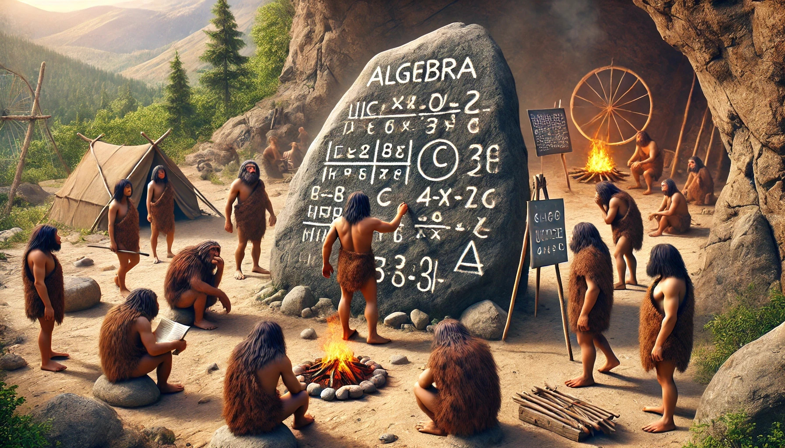
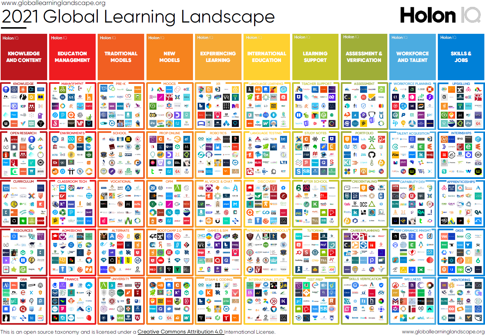

<!--

author:  André Dietrich; Sebastian Zug
email:   LiaScript@web.de
version: 0.0.2

language: de

narrator: Deutsch Male

@embed.edit
@embed_(edit,height: 80vh; min-width: 100%; border: 1px black solid,````@0
````)
@end

@embed.edit.style
@embed_(edit,@0,````@1
````)
@end

@embed.preview
@embed_(preview,height: 80vh; min-width: 100%; border: 1px black solid,````@0
````)
@end


@embed.preview.style
@embed_(preview,@0,````@1
````)
@end


@embed
@embed_(none,height: 80vh; min-width: 100%; border: 1px black solid,````@0
````)
@end


@embed.style
@embed_( ,@0,````@1
````)
@end


@embed_
<script run-once modify="false">
let code = `@'2`

code = btoa(unescape(encodeURIComponent(code)))

let embed ="@0"

if (embed=="preview" || embed=="edit") {
  embed += "/"
} else {
  embed = ""
}

'HTML: <iframe loading="lazy" style="@1" src="https://liascript.github.io/LiveEditor/?/embed/code/' + embed + code + '"></iframe>'
</script>
@end

-->

# Why Open Education Needs a Common Language!?

— André Dietrich and Sebastian Zug —
------------------------------------

A better question would be: __Why do commercial offerings and e-learning platforms dominate online education and "NOT" Open Educational Resources (OER)?__
Before we attempt to answer these questions, we want everyone to complete the following sentence for themselves:

Open Educational Resources (OER) are primarily about ...

1. ... the use of content.
2. ... their creation.

It is no wonder that many initially think of licenses and terms of use.
Creation (2.) seems boring and time-consuming.
As an OER enthusiast, one starts with big ideas, which often fail due to a lack of technical skills and underestimated effort.
Thus, most projects unfortunately end in static formats such as PDFs, Word documents, images, or PowerPoint presentations.
Podcasts or educational films are more elaborate, and creating a website requires even more effort.
With some programming knowledge, one might even create an entire app.
With a Word document, an individual can still make changes (leaving aside the collaboration of author teams), but PDFs, videos, and podcasts are one-way products (which cannot be adjusted afterward), and with websites and apps, an outsider might be able to make changes but faces insurmountable technical hurdles or simply lacks access rights.
In the worst case, development and hosting even incur costs that one has to bear themselves.

Participation, as we wish for it and as we know it from the open-source world, is actually not possible in this way.
Cynically viewed, the PDF file is the stone tablet of the digital age, static and optimal for print media (but not suitable for reading on a smartphone), not interactive, and difficult to change.
However, a computer enables us to experiment, simulate, immerse in content, change something, and verify it.



Why can't an OER enthusiast simply change two lines in an app or translate it?
Or why can't a user (students/parents) rephrase quiz questions or even restructure content?

As mentioned before, because the technical skills are lacking and secondly, because it could otherwise lead to a huge mess with different versions.

***But that's exactly what OER creation is about: diversity, changeability, and continuous improvement ...***

> __Spoiler Alert:__ The following video shows how interactive teaching content is created at [TU Bergakademie Freiberg](https://tu-freiberg.de) with LiaScript and hosted on [GitHub](https://github.com/TUBAF-IfI-LiaScript) (we will get to both).
> Each point represents a file and each figure a person who changes, adds, or deletes a file; these are on one hand employees of the Software Development and Robotics working group and on the other hand students.
>
> !?[Collaboration in the creation of OER at TUBAF](./video/tubaf.mp4)
>
> Source: https://github.com/TUBAF-IfI-LiaScript/

If we orient ourselves towards the open-source movement, then OER could actually work, right?
Many initially small projects that grow over time and through organized and decentralized participation of many over the years.
How does that work?

## About the Economics of Open-Source Projects

One thing is clear: Everyone who works on an open-source project has a common goal.
They use a library or app for their own purposes and give back a part of their value creation.
When large companies like Facebook or Microsoft release open-source projects, the many volunteers are an enormous force that not only finds bugs but also brings in extensions, writes tests, and documentation.
They benefit from it themselves.

Imagine if large educational publishers in Germany put their content online under a free license as an OER/OS project, so that many teachers and learners could work together on the materials or create their own versions from them.
**Unthinkable!** And why is that?


Because open-source projects have something that OER (still) does not: a common (programming) language.
A language in which communities develop around small or huge projects, be it the Linux operating system, the Firefox browser, AI projects, or educational apps.


Besides the language, there is another ingredient that allows the work of countless authors to be organized, versioned, and orchestrated.
A decentralized version control tool called [`git`](https://en.wikipedia.org/wiki/Git) is used for this, with [GitHub.com](https://github.com) as the largest platform.
Review systems, discussions, automated tests (spelling), and much more are already integrated here.
These problems are considered solved here and are nothing new for most developers and have been for over a decade.

What does the e-learning community or edTech have to counter this? Right, an almost endless number of platforms, tools, and formats that drive us more and more apart and isolate us rather than bring us together.
Who knows that on Moodle XY, which is hosted at school ABC in Weißenfels, a teacher is developing a similar course to mine ...



In the following sections, we will deal with the LiaScript language.
There are already many good tutorials and courses on git and GitHub.
In the following video, you will get a very good brief introduction to the concepts of git and GitHub.
Believe us, it is worth it.

!?[YouTube: GitHub Beginner Tutorial in 20 Minutes](https://www.youtube.com/watch?v=0jzjz4MZ4ZU)

Unlike all other platforms you may have tried, GitHub will be the last one you will use.

> Fun Fact: Git also comes from the pen of Linus Torvalds, the developer of Linux.
> He was dissatisfied with the commercial version control tools at the time and sought a way to work on Linux in a decentralized and offline manner.
> Here is a short history of git:
>
> https://git-scm.com/book/en/v2/Getting-Started-A-Short-History-of-Git


## LiaScript – A Language for OER

The idea for LiaScript originated in 2017/2018 in the "Industrial eLab" project.
It was about developing online labs for teaching in engineering sciences.
The following video shows our first steps with LiaScript.

!?[YouTube: Industrial eLab Project](https://www.youtube.com/watch?v=bICfKRyKTwE)

We were looking for a way to quickly and easily produce teaching content as a team.
[Markdown](https://en.wikipedia.org/wiki/Markdown), as an easy-to-learn and already established markup language, offered itself as a common foundation.
[HTML](https://en.wikipedia.org/wiki/Hypertext_Markup_Language) is also a markup language, as the name __HyperText Markup Language__ suggests, but it is much more complicated.
Markdown has now become the standard for blogging ([JAM-Stack](https://jamstack.org)), documentation of IT projects ([GitHub](https://github.com)), with editors in [Moodle](https://docs.moodle.org/404/en/Markdown) and others – all use/support Markdown more or less.

Try sending the following message via WhatsApp:

```markdown @embed.style(height: 420px; min-width: 100%; border: 1px black solid)
# Shopping List

> For a Pizza Margarita we need

1. `Dough`
2. _Tomatoes_
3. _Cheese_
4. ~no Salami~
```

With such annotations, Markdown allows simple formatting like code, italics, bold, and strikethrough in texts, and these can also be combined/nested. Texts can be structured just as easily:

```markdown @embed.style(height: 510px; min-width: 100%; border: 1px black solid)
# Heading

A paragraph rarely
comes alone ...

- A list
- With various
- Sub-points

| Tables |   are   |    easier |
| ------ | :-----: | --------: |
| than   | thought |       and |
| self-  |   ex-   | planatory |
```

You can immediately see what is a table and what is a list. As a finger exercise, everyone can try to expand the table with more cells or columns. Then simply press the "Compile" button at the top right and observe how the result changes. In your mind, try to remember which menu items in Word or PowerPoint need to be clicked for this. If you can do that, then we are more than impressed ;-)

### Visual Metaphors & Quizzes

You can think of Markdown as a kind of "visual metaphor" to describe the structure of texts and other elements.
Your canvas is a simple text file and your brushes are the keyboard.
No clicking and remembering complicated sequences with different menus, just writing and seeing what happens.
This was also our core idea in developing LiaScript, to bring the didactic experts on the team on board.
We wanted to extend the visual and simple language of Markdown and add more interactive elements that seamlessly integrate into the Markdown language.

The following example shows a simple "to-do" list:

```markdown @embed.style(height: 350px; min-width: 100%; border: 1px black solid)
# To-do

- [X] Already done
- [ ] Still open
- [X] Completed ...
```

We have simply further developed these to-do lists, as shown below, to also include quizzes and surveys in our teaching materials.
This allowed the didactic experts to gather feedback from the students or observe their progress.

```markdown @embed.style(height: 410px; min-width: 100%; border: 1px black solid)
# Multiple-Choice Quiz

Can a quiz be any simpler?

- [[X]] No
- [[X]] Maybe/Uncertain
- [[ ]] Yes
```

The square representation above is reminiscent of checkboxes as used in HTML.
For single-choice quizzes, one would use round radio buttons, where only one option can be selected:

```markdown @embed.style(height: 410px; min-width: 100%; border: 1px black solid)
# Single-Choice Quiz

Representing radio buttons with parentheses seems logical, doesn't it?

- [( )] Don't know
- [(X)] Definitely
- [( )] No way
```

#### More Quizzes

If you extend this idea by using double brackets `[[...]]` for quizzes, you can create a variety of other quizzes in the form of cloze tests, selection options, matrix quizzes, etc., in combination with other Markdown elements.
Here is an example of a "German Grammar Test":

```markdown @embed.preview.style(height: 730px; min-width: 100%; border: 1px black solid)
# German Grammar Test

| Verb    | Person    | Präsens von "werden" |    Partizip II   | Infinitiv von haben/sein |
| ------- | --------- | :------------------: | :--------------: | :----------------------: |
| gehen   | Ich       |     [[ werde  ]]     |  [[ gegangen ]]  |       [[ sein  ]].       |
| sagen   | Du        |     [[ wirst  ]]     |  [[ gesagt   ]]  |       [[ haben ]].       |
| machen  | Er/Sie/Es |     [[ wird   ]]     |  [[ gemacht  ]]  |       [[ haben ]].       |
| laufen  | Wir       |     [[ werden ]]     |  [[ gelaufen ]]  |       [[ sein  ]].       |
| singen  | Ihr       |     [[ werdet ]]     |  [[ gesungen ]]  |       [[ haben ]].       |
| spielen | Sie       |     [[ werden ]]     |  [[ gespielt ]]  |       [[ haben ]].       |
```

Admittedly, the above example for a quiz is a bit too large; it was only meant to serve as an example.
LiaScript offers additional possibilities to provide hints or additional options, making it easier to design or configure a quiz.

#### Surveys

Admittedly, the above example for a quiz is a bit too large; it was only meant to serve as an example.
LiaScript offers additional possibilities to provide hints or additional options, making it easier to design or configure a quiz.

```markdown @embed.style(height: 410px; min-width: 100%; border: 1px black solid)
# What are your favorite colors?

- [[red]]     Is it red,
- [[green]]   green
- [[blue]]    or blue,
- [[violet]]  last chance ;-)
```

__Try converting this multiple-choice survey into a single-choice survey yourself.__

The advantage of developing learning content in this way was that it could be created by us without any configuration effort and as a team, with the computer scientists creating the learning content and the didactic experts creating the surveys and quizzes to test the knowledge level.

### Multimedia

YouTube offers a variety of educational materials, but they cannot be directly embedded in Markdown because most Markdown viewers prohibit JavaScript or embedding external content via [IFrames](https://en.wikipedia.org/wiki/Inline_frame).

To also be able to use such content and embed it in LiaScript courses, we have extended the syntax as before.
The following example first shows the general Markdown syntax for embedding links and images; then come the LiaScript extensions:

``` markdown @embed.style(height: 710px; min-width: 100%; border: 1px black solid)
# Multimedia References

- __Markdown__

  - Links or references:
    `[name](url)`

    [Open Educational Resources](https://en.wikipedia.org/wiki/Open_Educational_Resources)

  - An image is an important link __!__ :
    ``

    

- __LiaScript__

  - Is audio just as important __?__ :
    `?[alt-text](...mp3 or soundcloud-url)`

    ?[zugehOERt 104: How to OER-Policy](https://open-educational-resources.de/podlove/file/1666/s/webplayer/c/episode/OER104.mp3 "zugehOERt 104: How to OER-Policy? The OER-Policy Kit provides answers ... More information about the podcast can be found here: https://open-educational-resources.de/oer104/ ")<!-- style="width: 100%" -->

  - Then videos consist of image__!__ and sound__?__:
    `!?[alt-text](...mp4 or YouTube-url)`

    !?[Collaborative Online Editor for LiaScript](https://www.youtube.com/watch?v=EZuxYsMBKO4)

  - Last but not least, if you want to embed anything else:
    `??[alt-text](any-url)`

    ??[Phet: Build an Atom](https://phet.colorado.edu/sims/html/build-a-nucleus/latest/build-a-nucleus_all.html?locale=en)

    ??[SketchFab: Astraea (Orbicella) curta](https://sketchfab.com/3d-models/astraea-orbicella-curta-bb767cd759fc428081ec9c302baf1ed1 "Source: https://sketchfab.com")

    ??[GeoGebra: Derivative of Power Functions](https://www.geogebra.org/m/jt2eyurg "_It may take a while for the content to load on GeoGebra_")

    ??[Some Circuit](https://www.falstad.com/circuit/circuitjs.html?ctz=CQAgzCAMB0l3BWEBGATLBlWTADjagCzK4CcSmIFkVApgLTLIBQAhioYSEbt0d4V69kSRkmTx4HaKVmyA7NhyEAbAmSkU4yZGYB3Dl1RhUh7nCjMAxmaV8jFmjEnJCc9x7nTFcMCQSoyPKkgVCwkCwGqPx20UaClgauRiYoqLzGprrIKjRMphJc+SgqvDTYKDo6+mnCpbXcqboA5iCkKiW87Si4XE7MAE4NmSAqKVklcMwAlihoVB3FhVBhEcwASnOmCB1jCys0hOVOB9AIbPbce36mqHu8SHlVYajB7QhggjnyYJDkHU9JMxWnFuLhyjFuv0REgblcuGB5B07kVEuB5ukaHCwLk0YiOtikeBcboDPjiVj5jj+ptsbj0rxqShuKMLOgkOzTuckukUDjwETkPzSQLFvzyagocwclxCKlfrLweBIKi+gcqCAAC4DACutEsmzlpiOWKJJpWt3KZ241voMCChA+ktQ6lkRvIYVIG1se2KKPVRy06pg3Ip3G6EqlOV4gixKqoVPjEC4jwOzAAslReQqFnG1eyM1nGRUEESTCcC5mAoz+QgQuBhTbzlXswFWYy21bQ7HiTGleaRUbwG2hwPvT3zROmiyKpzOfQwNBXCIQmowAgyMEICHvXsRoGRodmfJrSfUzuRBByTmhznkCyaOcAPbgUx7Q5-DLW5yQFQui2vuAzAvv+74gEcpBlOEcBIpKYCkI6NyPNBfxIjs-73iwIG7GqEFQZIsGkPBiFoMhkikGhf7iCgwHcPIoy4Z+qzwIRxEfKRzFwBRahUcyWFggxKx4RqP5cZRGE0UAA "_Source: https://www.falstad.com _")

```

The double question marks `??` in the last links indicate that the content should somehow be embedded. LiaScript uses various browser-side strategies to embed simulations from [Phet](https://phet.colorado.edu), 3D models from [SketchFab](https://sketchfab.com), or circuits from [Falstad](https://www.falstad.com).
We have explained the internal workings of LiaScript in more detail in the following blog post:

[Embedding Multimedia - How does it work??](https://liascript.github.io/blog/embedding-multimedia-how-does-it-work/)

### Programming in Markdown

When learning to program, many code examples are essential.
For this purpose, Markdown already has a syntax, so-called code blocks, which are enclosed with at least three backticks.

```` markdown @embed.style(height: 380px; min-width: 100%; border: 1px black solid)
# A Simple JavaScript Example

```javascript
var x = 'Hello World'
console.log(x)
33 * 12
```
````

The top term is an indicator for the programming language and the syntax highlighting to be used, followed by the actual code.
Originally, we used a separate editor for our robotics projects, which forced students to constantly copy code back and forth.
Our Arduino robots were programmed in C++, which raised the questions:

- **Why can't the code examples be executed directly?**
- **And what is actually necessary to execute code in other languages?**

Our solution was to append a `<script>` tag that defines how the above code or text should be interpreted.
For JavaScript, this is relatively simple:

```` markdown @embed.style(height: 380px; min-width: 100%; border: 1px black solid)
# A Simple and interactive JavaScript Example

```javascript
var x = 'Hello Welt'
console.log(x)
33 * 12
```
<script> @input </script>
````

Every code block to which a `<script>` tag is appended is interpreted in LiaScript as executable code with console output.
Click on Execute and observe how the output changes.
Such execution instructions can also be attached to quizzes, surveys, or to-do lists to adjust their behavior.
`@input` simply defines a general placeholder here and everywhere, indicating where the current code should be inserted in the script.

Within a code block, changes are tracked using linear versioning.
In other words, you can move forward and backward in your versions and change an old state, which is then appended as a new state – no change is lost.

The didactic experts on our team could directly analyze the students' approach to programming.
At this point, many ask: Where are the data/states stored in LiaScript – the code, the quizzes, and surveys?
The answer is simple: directly in the user's browser.
Modern browsers have built-in databases like [IndexedDB](https://en.wikipedia.org/wiki/Indexed_Database_API), which we use to store the courses and all related information.
With LiaScript, it is therefore not necessary to send data around the globe and store it in a central database.
Instead, LiaScript works in a decentralized manner.
Knowledge can also be tested offline, meaning each user can go through the learning materials at their own pace and completely anonymously.

In the "Industrial eLab" project, we reused this data for research purposes.
We ourselves did not yet know the possibilities a modern browser offers.

#### Projects

In addition to simple code blocks, projects can also be defined that consist of multiple code blocks/files.
These are simply concatenated and also appended with an additional `<script>` tag.
To avoid confusion with the blocks, it must be specified which block is to be inserted where.
`@input(0)` addresses the first code block and `@input(1)` refers to the JSON file, etc.

```` markdown @embed.style(height: 600px; min-width: 100%; border: 1px black solid)
# A Simple Project

``` js     -EvalScript.js
let who = data.first_name + " " + data.last_name;

if(data.online) {
  who + " is online";
}
else {
  who + " is NOT online";
}
```
``` json    Data.json
{
  "first_name" :  "Sammy",
  "last_name"  :  "Shark",
  "online"     :  true
}
```
<script>
  // insert the JSON dataset into the local variable data
  let data = @input(1);

  // eval the script that uses this dataset
  eval(`@input(0)`);
</script>
````

Open the upper part, adjust both code blocks, and click on "Execute".
Whether a block is open or closed is defined by a plus or minus sign in front of the file name.

External libraries or external services like our [CodeRunner](https://github.com/liaScript/coderunner) can also be used for execution.
The scripts necessary for this quickly grow in scope and complexity, making them difficult to maintain.
To counteract this, we developed a macro system that allows recurring tasks to be simplified (automated), as is common in computer science.
In LiaScript, Markdown documents can be treated like libraries that implement specific functions and can be reused in other courses or Markdown files.
The idea behind this is explained in the next section; if this is too technical for you, you can skip this part.

### Extensions and Macros

Macros are an excellent way to simplify and automate recurring tasks.
In short, these are just text replacements that can be inserted at any point.
To do this, simply define a command/name in an HTML comment at the beginning of the document, followed by everything that should be inserted:

``` markdown @embed.style(height: 280px; min-width: 100%; border: 1px black solid)
<!--
@Command: Here a whole __text__ is inserted.
-->

# Title

@Command
```

As in other programming languages, these can also be parameterized in LiaScript.
In the macro body, the places to be replaced are marked with `@0..9`:

```` markdown @embed.style(height: 350px; min-width: 100%; border: 1px black solid)
<!--
@important: <span style="color: @0">@1</span>
-->

# Title

@important(red,This text will be displayed in red)

---

@important(green,And I will be green...)
````

#### Importing Extensions

Of course, no one wants to always copy all commands back and forth.
As you would expect from a library, such macro collections can be easily integrated into the current course using an `@import` statement.
In the following example, another document is imported that allows embedding [ABC notations](https://en.wikipedia.org/wiki/ABC_notation) for creating musical scores.

```` markdown @embed.edit.style(height: 800px; min-width: 100%; border: 1px black solid)
<!--
import: https://raw.githubusercontent.com/LiaTemplates/ABCjs/0.0.2/README.md
-->

# Music

``` abc  @ABCJS.render
X: 1
T: Shche ne Vmerla Ukrayiny ni Slava, ni volya
T: Ukrainian National Anthem
C: trad.
R: march
M: C
L: 1/8
K: F
[|\
"F"[A3F3][AF] ([AF][GE][AF])[BG] | [c3A3][BG] "A7"[A2F2][G2E2^C2] | "Dm"[F2D2][A2F2] "A"[E2^C2][A2C2] | "Dm"[D3D3][E^C] [F2D2]"C"[G2E2] |
"F"[A3F3][AF] ([AF][GE][AF])[BG] | [c3A3][BG] "A7"[A2F2][G2E2^C2] | "Dm"[F2D2][A2F2] "A"[E2^C2][A2C2] | "Dm"[D4D4] D2z2 |
"A"[E2^C2][E2C2] ([AC][GE][FD])[EC] | ("Dm"[DD3-]EF)[DD] "A"[E2^C2][E2C2] | "Dm"[F2D2][F2D2] "C"[G2E2][G2E2] | "F"[A4F4] [A2F2]z2 |
"A"[E2^C2][E2C2] ([AC][GE][FD])[EC] | ("Dm"[DD3-]EF)[DD] "A"[E2^C2][E2C2] | "Dm"[F2D2][A2F2] "A"[E2^C2][A2C2] | "Dm"[D3D3][E^C] ([FD][GE][AF])[BG] |
|:\
"F"[c3A3][=B^G] [c2A2][A2F2] | "C"[G2E2][G2E2] ([cE][BG]"^A7/C#"[AF])[GE] | "Dm"[F2D2][F2D2] "C"[G2E2][G2C2] | ("F"[A3F3][GE][A2F2])"C7"[B2G2] |
"F"[c3A3][=B^G] [c2A2][A2F2] | "C"[G2E2][G2E2] ([cE][BG]"^A7/C#"[AF])[GE] | "Dm"[F2D2][A2F2] "A"[E2^C2][A2C2] | "Dm"[D4D4] [D2D2]z2 :|
```
````

Why shouldn't you be able to program with music as well?
Notes are a form of programming language that allows you to compose music.
And in LiaScript, this can also happen interactively using ABC notation.
Change the code and click on "Compile" to see and hear the changes.
As shown in the section "[Programming in Markdown](#programming-in-markdown)", you only need to append a `<script>` tag.
In the example below, this happens automatically by appending the macro `@ABCJS.eval`.

````` markdown @embed.style(height: 700px; min-width: 100%; border: 1px black solid)
<!--
import: https://raw.githubusercontent.com/LiaTemplates/ABCjs/0.0.2/README.md
-->

# Music

``` abc
X: 1
T: Cooleys
M: 4/4
L: 1/8
K: Emin
|:D2|"Em"EBBA B2 EB|~B2 AB dBAG|"D"FDAD BDAD|FDAD dAFD|
"Em"EBBA B2 EB|B2 AB defg|"D"afe^c dBAF|"Em"DEFD E2:|
|:gf|"Em"eB B2 efge|eB B2 gedB|"D"A2 FA DAFA|A2 FA defg|
"Em"eB B2 eBgB|eB B2 defg|"D"afe^c dBAF|"Em"DEFD E2:|
```
@ABCJS.eval
`````

Text can also be analyzed to improve readability or style, for example.
At TU Freiberg, this is used in foreign language classes to provide students with direct feedback using various metrics:

```` markdown @embed.style(height: 570px; min-width: 100%; border: 1px black solid)
<!--
import: https://raw.githubusercontent.com/liaTemplates/TextAnalysis/main/README.md
-->

# Textanalyse

```text
Playing games has always been thought to be
important to the development of well-balanced and
creative children; however, what part, if any,
they should play in the lives of adults has never
been researched that deeply. I believe that playing
games is every bit as important for adults as for
children. Not only is taking time out to play games
with our children and other adults valuable to
building interpersonal relationships but is also a
wonderful way to release built up tension.
```
@Textanalysis.FULL
````

As already mentioned, we mostly use LiaScript for learning to program. An overview of existing extensions can be found here:

https://github.com/topics/liascript-template

Otherwise, we are happy to add new extensions for you or support you in this process in LiaScript.

```` markdown @embed.preview.style(height: 680px; min-width: 100%; border: 1px black solid)
<!--
import: https://raw.githubusercontent.com/liaTemplates/vtk/master/README.md
-->

# Medical courses would be nice too

@VTK.loadIframe(https://kitware.github.io/vtk-js-datasets/data/vti/head-binary-zlib.vti)
````

And for scientific publishing, there are also extensions that you can use:

```` markdown @embed.preview.style(height: 680px; min-width: 100%; border: 1px black solid)
<!--
import: https://raw.githubusercontent.com/LiaTemplates/citations/main/README.md
-->

# Literature

```bibtex @bibliography.style(ieee)
@InProceedings{dietrich2019,
  author    = {André Dietrich},
  title     = {LiaScript: a domain-specific-language for interactive online courses},
  booktitle = {Proceedings of the International Conference on e-Learning 2019},
  year      = {2019},
  pages     = {186--194},
  address   = {Porto, Portugal}
}

@misc{liascript2024,
  author       = {André Dietrich; Sebastian Zug},
  title        = {LiaScript - Open Educational Resources made Easy and Decentralized ...},
  howpublished = {\\url{https://liascript.github.io}},
  year         = {2024},
  note         = {Accessed: August 29, 2024}
}
```
````

### Additional Features

#### Different Display Formats

Since computer scientists tend to optimize and automate work, we have integrated the function in LiaScript to read a document either page by page like a normal book or to include animation steps.
Thus, the same document can be used both as a slide set in lectures and by students in book mode or presentation mode with built-in speech output.
Modern browsers nowadays offer text-to-speech functions, the quality of which can vary depending on the device, operating system, and browser.

We don't want to go into too much detail here, but the following video provides a brief summary of the usage.
Similar to quizzes, everything related to animations or speech output is marked by two curly braces `{{}}`.

!?[TTS in LiaScript](https://www.youtube.com/watch?v=saxAFw7XpjI)

Recently, you can even use your audio recordings or video recordings to narrate your courses.
You are already familiar with the LiaScript notation for audio and video.
The following video shows how you can link these with the comments.

!?[Video and Audio Comments](https://www.youtube.com/watch?v=lOOcD2ES35I)

#### ASCII Art

[ASCII Art](https://en.wikipedia.org/wiki/ASCII_art) stands for "American Standard Code for Information Interchange" art, a graphic design technique where images, symbols, or text are created by arranging characters from the ASCII character table.
This art form, which dates back to the early days of computer technology, originated from the need to create graphical representations on devices with limited graphical capabilities.

In LiaScript, ASCII art can be used creatively to integrate visual representations directly into texts.
This can be particularly useful for creating simple diagrams, sketches, or symbols without requiring external image files.

```` markdown @embed.edit.style(height: 750px; min-width: 100%; border: 1px black solid)
# ASCII-Art

<!-- style="height: 60vh" -->
```ascii
                                       Peer A
                                       Server-Reflexive    +---------+
                                       Transport Address   |         |
                                       192.0.2.150:32102   |         |
                                           |              /|         |
                         TURN              |             /^|  Peer A |
   Client's              Server            |            / ||         |
   Host Transport        Transport         |           /  ||         |
   Address               Address           |      ____/   |+---------+
  10.1.1.2:49721       192.0.2.15:3478     |+-+  /      Peer A
           |               |               ||N| /       Host Transport
           |   +-+         |               ||A|/        Address
           |   | |         |               v|T|     92.168.100.2:49582
           |   | |         |               /+-+
+---------+|   | |         |+---------+   /              +---------+
|         ||   |N|         ||         | _/               |         |
| TURN    |v   | |         v| TURN    |/                 |         |
| Client  |----|A|----------| Server  |------------------|  Peer B |
|         |    | |^         |         |^                ^|         |
|         |    |T||         |         ||                ||         |
+---------+    | ||         +---------+|                |+---------+
               | ||                    |                |
               | ||                    |                |
               +-+|                    |                |
                  |                    |                |
                  |                    |                |
            Client's                   |            Peer B
            Server-Reflexive    Relayed             Transport
            Transport Address   Transport Address   Address
            192.0.2.1:7000      192.0.2.15:50000     192.0.2.210:49191
```
````

Of course, LiaScript and Markdown can also be seamlessly combined with ASCII graphics.
This allows for interesting combinations with quizzes, but also animations.
The LiaScript elements just need to be "marked" with quotation marks:

```` markdown @embed.preview.style(height: 650px; min-width: 100%; border: 1px black solid)
# ASCII-Art & Quizze

<!-- data-show-partial-solution -->
``` ascii
                        .----------------------.
                       /                      /|
             .--------+----------------------+ +---------.
            /         |      " [[  24   ]] " |/         /|
  .--------+----------+----------+-----------+---------+ +----------.
 /         |         11          |      "[[   13   ]] "|/          /|
+----------+----------+----------+----------+----------+----------+ +
|      " [[   5   ]] "|          6          |          7          |/
+---------------------+---------------------+---------------------+
```
````


#### Automatic Visualizations

Datasets in tables are automatically analyzed, and various rules are used to try to find the best representation.
Switch to the table view, rearrange the columns, and observe how the visualization adjusts.

``` mardown @embed.preview.style(height: 750px; min-width: 100%; border: 1px black solid)
## Tabellen

<!-- data-show -->
| Animal          | weight in kg | Lifespan years | Mitogen |
| --------------- | -----------: | -------------: | ------: |
| Mouse           |        0.028 |              2 |      95 |
| Flying squirrel |        0.085 |             15 |      50 |
| Brown bat       |        0.020 |             30 |      10 |
| Sheep           |           90 |             12 |      95 |
| Human           |           68 |             70 |      10 |
```

Anyone who wants to start drawing right away can do so and draw simple diagrams and curves.
If it looks like a diagram, then it probably is a diagram ...

``` markdown @embed.style(height: 610px; min-width: 100%; border: 1px black solid)
### ASCII-Art-Diagrams

                                Multiline
1.9 |
    |                 ***
  y |               *     *
  - | r r r r r r r*r r r r*r r r r r r r
  a |             *         *
  x |            *           *
  i | B B B B B * B B B B B B * B B B B B
  s |         *                 *
    | *  * *                       * *  *
 -1 +------------------------------------
    0              x-axis               1
```

#### Formulas

In LiaScript, formulas can be easily inserted into Markdown documents by using the proven [LaTeX syntax](https://en.wikibooks.org/wiki/LaTeX/Mathematics).
This syntax allows for clear and precise representation of mathematical expressions, which is particularly important in scientific and technical texts.

The __inline notation__ is used to insert formulas directly into the text.
This is done by placing the mathematical expression between two dollar signs (`$...$`).
This method is ideal for shorter formulas or simple mathematical expressions that fit into a sentence.

For more complex or extensive formulas that require their own line, the block notation is used.
Here, the mathematical expression is placed between two double dollar signs (`$$...$$`).
The formula is then centered and prominently displayed.

```markdown @embed.style(height: 400px; min-width: 100%; border: 1px black solid)
# Formulas

The formula for calculating the area of a circle is $A = \pi r^2$.

Who knows what this formula calculates?

$$
\lim_{n \to \infty} \left( \sum_{i=1}^{n} \frac{1}{i^2} \cdot \int_{a}^{b} e^{-x^2} dx \cdot \prod_{j=1}^{m} \left( \frac{\partial}{\partial x_j} \mathbf{A} \right) \cdot \det \left( \mathbf{M}_{ij} \right) \cdot \mathbf{C} \right) + \iint_{S} \nabla \times \mathbf{F} \cdot d\mathbf{S}
$$
```

LiaScript offers much more, but we want to leave it with the "static" elements and move on to dynamic elements in the next section.
A feature that we wanted to integrate from the beginning and which we still see as a hidden gem of LiaScript is the use of JavaScript.

### JavaScript Everywhere

__JavaScript?__
At first glance, this doesn't sound particularly grand, but we were inspired by Bret Victor.
Here is a lecture that summarizes many of his ideas, many of which should also flow into OER projects:

!?[Media for Thinking the Unthinkable](https://www.youtube.com/watch?v=oUaOucZRlmE)

We have reinterpreted the use of JavaScript.
Free `<script>` tags can appear anywhere in the text in LiaScript.
Unlike Jupyter Notebooks, where text is written around the code, in LiaScript the code is directly embedded in texts, tables, etc.

The execution of a script can have a result that is also displayed directly.
Unlike in JavaScript, where the code merely manipulates the document from the outside and makes changes that are difficult for the user or reader to interpret.
What does this look like specifically?

In the simplest case, calculations that you do not want to perform yourself can be executed within such a script:

``` markdown @embed.style(height: 300px; min-width: 100%; border: 1px black solid)
# Simple Calculations

The square root of 1122.25 is
<script>Math.sqrt(1122.25)</script>
.
```

This is nothing special yet.
But if we imagine how many educational materials use current climate, economic, or social data, it quickly becomes clear how important it is that this data is not only correct but also up-to-date.

A simple example of this is calendar calculation:

``` markdown @embed.style(height: 500px; min-width: 100%; border: 1px black solid)
# A Military "Special" Operation

Russia started its invasion of Ukraine
<script format="relativetime" unit="day" locale="en">
// Date of the invasion
const invasionStartDate = new Date('2022-02-24');
// Get the current time
const currentDate = new Date();
// Calculate the difference in milliseconds
const differenceInMs = currentDate - invasionStartDate;

// Convert milliseconds to days
const differenceInDays = differenceInMs / (1000 * 60 * 60 * 24);
// Calculate the number of full days
const daysSinceInvasion = Math.floor(differenceInDays);

// Return result
-daysSinceInvasion
</script>.
```

This document will now always display the actual number of days and format it accordingly.
The highlighted background indicates that this text or number was generated by the calculation of a script.
The user also has the option to inspect and modify the respective code by double-clicking.
You don't have to blindly trust the results of calculations summarized in a document; you can also directly verify them and perform your own calculations.

In LiaScript, we can go a step further and link scripts directly with input options as well as connect scripts with each other.
This means that if the result of one script changes, the dependent scripts will also be recalculated.
The parameter 'output' is used to give the script a name.
This result can then be referenced within other scripts throughout the document using '@input(`name`)'.
Within LiaScript, a processing graph is created where scripts whose inputs '@input's have changed are recalculated.

Change the values of the sliders and observe the changes in the diagram.

``` markdown @embed.preview.style(height: 860px; min-width: 100%; border: 1px black solid)
# Power Functions

$a =$ <script modify="false" input="range" step="1"   min="-1"  max="6"  value="2" output="a" input-always-active>@input</script>,\
$b =$ <script modify="false" input="range" step="0.1" min="-10" max="10" value="0" output="b" input-always-active>@input</script>,\
$c =$ <script modify="false" input="range" step="0.1" min="-10" max="10" value="0" output="c" input-always-active>@input</script>

<script modify="false" run-once style="display: inline-block; width: 100%">
"LIASCRIPT: ### $$f(x) = x^{@input(`a`)} + x * @input(`b`) + @input(`c`)$$"
</script>

<script run-once style="display: inline-block; width: 100%">
function func(x) {
  return Math.pow(x,  @input(`a`)) + @input(`b`) * x + @input(`c`);
}

function generateData() {
  let data = [];
  for (let i = -15; i <= 15; i += 0.01) {
    data.push([i, func(i)]);
  }
  return data;
}

let option = {
  grid: { top: 40, left: 50, right: 40, bottom: 50 },
  xAxis: {
    name: 'x',
    minorTick: { show: true },
    splitLine: { lineStyle: { color: '#999' } },
    minorSplitLine: { show: true, lineStyle: { color: '#ddd' } }
  },
  yAxis: {
    name: 'y', min: -10, max: 10,
    minorTick: { show: true },
    splitLine: { lineStyle: { color: '#999' } },
    minorSplitLine: { show: true, lineStyle: { color: '#ddd' } }
  },
  series: [
    {
      type: 'line',
      showSymbol: false,
      data: generateData()
    }
  ]
};

"HTML: <lia-chart option='" + JSON.stringify(option) + "'></lia-chart>"
</script>
```

Now everyone is probably thinking: _"Phew, that's really just for programmers."_
But far from it.
Thanks to [ChatGPT](https://chatgpt.com), which also generates "Markdown", we can have such diagrams or other elements created by AI.
An AI will not achieve this right away if it has not been trained on LiaScript, but we can give it context.
In this case, the context would be an example from the documentation that we would like ChatGPT or [Claude.AI](https://claude.ai) to adapt for our purposes.

In the following blog post, we show how to generate various diagrams with a single prompt, using the above example, without writing a single line of code ourselves:

https://liascript.github.io/blog/creating-interactive-diagrams-with-chatgpt/

## Why LiaScript?

We believe that OER does not need another platform, learning management system, or authoring tool that only further separates OER creators.
Instead, we need a simple language that anyone can use and extend.
A language in which teams can collaborate to work on content, functionality, and representations together, each in their own way.
A language for OER offers another advantage over platforms and tools: users can freely express their creativity, develop their own functions and extensions using this language, and are not trapped in fixed input masks and structures.

Decentralization can also foster innovation by allowing for experimentation and local adaptations without the failure of a single project endangering the entire system.
A decentralized approach could also promote the development of open, community-shared resources that are freely accessible and can be further developed by the entire educational community.
This would not only improve the sustainability of the projects but also promote the democratization of knowledge.

In summary, LiaScript offers the following:

* __Accessibility:__
  Anyone can create or edit materials with a simple text editor.
  No special software is required.

* __Interactivity:__
  Add quizzes, simulations, and videos directly into your documents to make learning more exciting and effective.

* __Collaboration:__
  By using GitHub, you can work on projects together, track changes, and manage different versions of a document – all in a form understandable to non-technicians.

* __Decentralization:__
  Your content is not tied to a specific platform.
  It can be freely shared and adapted, creating a true community around learning.

Decentralization in combination with Git and GitHub/GitLab/Bitbucket also offers a completely different form of sustainability:
No intermediate version is lost; each of these intermediate versions can be recalled and restored as a course.
Anyone using Git or another version control tool has the entire history of a project locally.
If GitHub goes offline tomorrow, all participants still have the complete state and can still make changes and synchronize versions with each other without GitHub as a central repository.

## Decentralization

Finally, we want to clarify how courses are shared when they are stored and developed in a decentralized manner.
For this, only the URL of the plain text file is needed, which either refers to a version on GitHub/GitLab (free) or is hosted by the OER content creators themselves.
This "document" can be found, for example, on GitHub in the following project:

https://github.com/LiaPlayground/Warum-offene-Bildung-eine-Sprache-braucht

To access the plain Markdown file, you either click on the corresponding file and then on the small "Raw" button to get the following URL:

https://raw.githubusercontent.com/LiaPlayground/Warum-offene-Bildung-eine-Sprache-braucht/main/English.md

If you look closely, you will notice that the URL has changed from `github.com` to `raw.githubusercontent.com` and the additional `/main/README.md` suffix has been added.
This means the main branch of the project is used, and the `README.md` file is downloaded.
As mentioned earlier, on GitHub you could also access other branches or previous versions.
What is now missing is that this URL is passed as a parameter to the LiaScript website.

https://liascript.github.io/course/?https://raw.githubusercontent.com/LiaPlayground/Warum-offene-Bildung-eine-Sprache-braucht/main/English.md

At first glance, this may seem cumbersome, but it has the advantage that we can change and adapt our content at any time without the URL changing.
The LiaScript website is a so-called [PWA (Progressive Web App)](https://en.wikipedia.org/wiki/Progressive_web_app), a pure JavaScript application that can also be installed on the end device.
The URL parameter instructs the app to download, analyze, and render the Markdown file located behind the URL locally in the user's browser.
The first load may take a little longer as the entire structure is analyzed first.
The result is stored in the browser itself in the internal IndexedDB database, so it can also be accessed offline.
If you click on the home screen in the table of contents, you switch to the following index view:

https://liascript.github.io/course/

Here, any visited course can be recalled, and you can continue with the material.
The LiaScript site is more of a reader/interpreter for LiaScript Markdown than a traditional website.
We update the website/interpreter, and you update your content.

#### Classrooms

Additionally, within a course, you can go to "Share Classroom," select one of several synchronization solutions, choose a random name for the classroom, and then click "Open."
You can share the new URL in the browser with your students, classmates, or colleagues, who can then join the same room.
Not only will the same course be opened, but all quizzes and surveys will also be anonymously synchronized.
The code editors have a collaborative mode where everyone in the room can work together, and there is a chat that also understands LiaScript syntax, allowing live surveys to be conducted in class similar to Mentimeter.

!?[Classroom Demo](https://www.youtube.com/watch?v=Kjk6OblugXI)

__Where are these data stored now?__
Here, too, only decentralized mechanisms are used.
The states of the browsers are synchronized, and if someone leaves the room, they take their own data with them.
And when everyone has left the room, these data are forgotten as well.
We call this concept Classroom-Lite ...

## Where do I start?

We hope we have convinced you, and if you now feel overwhelmed by the many features and wonder where to begin, how to create and share a course.

As a starting point, we recommend the LiaScript website, which we host for free on GitHub:

https://liascript.github.io

Here you will find more information and also the documentation, which is also written as a LiaScript course, as well as suggestions and news in our blog.
We also have a YouTube channel where we regularly introduce new features and use cases:

https://www.youtube.com/@liascript4180

For those who want to dive right in, we recommend watching the [Shorts](https://www.youtube.com/watch?v=saxAFw7XpjI&list=PL7LrRfaZulhch1ZtC6nSWOPcu1Xm80rlf) as well as the interactive documentation translated and recorded in LiaScript:

https://www.youtube.com/watch?v=ElxYssylmaw&list=PL7LrRfaZulhc3w4rebIl8Dnck6zqdKeNn

The entire project is hosted on GitHub:

https://github.com/LiaScript

You can give us feedback there, report bugs, or contribute your own extensions.
For quick answers and discussions, we also have a chat on Gitter:

https://app.gitter.im/#/room/#LiaScript_community:gitter.im

... or just send us an email at:

LiaScript@web.de

or follow and contact us on Twitter/X:

https://twitter.com/LiaScript