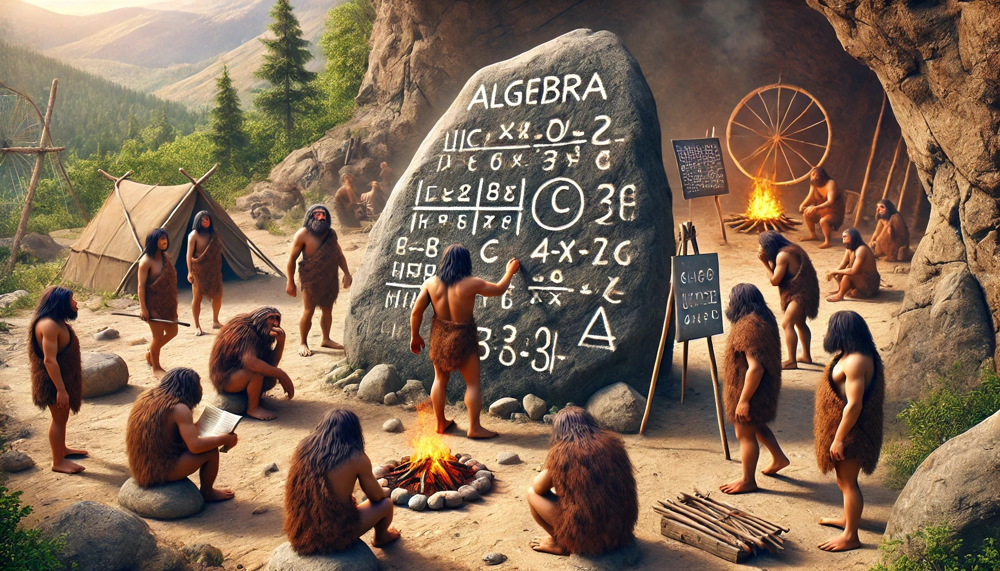
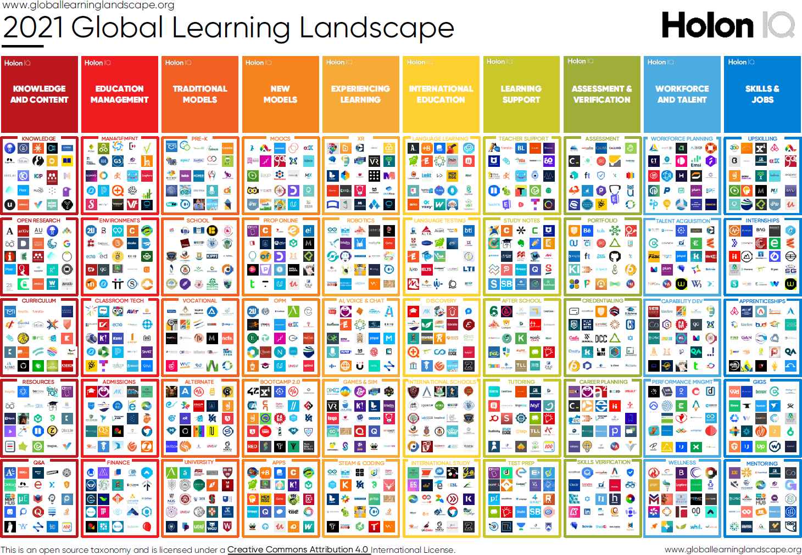

<!--

author:  André Dietrich; Sebastian Zug
email:   LiaScript@web.de
version: 0.0.2

language: de

narrator: Deutsch Male

@embed.edit
@embed_(edit,height: 80vh; min-width: 100%; border: 1px black solid,````@0
````)
@end

@embed.edit.style
@embed_(edit,@0,````@1
````)
@end

@embed.preview
@embed_(preview,height: 80vh; min-width: 100%; border: 1px black solid,````@0
````)
@end


@embed.preview.style
@embed_(preview,@0,````@1
````)
@end


@embed
@embed_(none,height: 80vh; min-width: 100%; border: 1px black solid,````@0
````)
@end


@embed.style
@embed_( ,@0,````@1
````)
@end


@embed_
<script run-once modify="false">
let code = `@'2`

code = btoa(unescape(encodeURIComponent(code)))

let embed ="@0"

if (embed=="preview" || embed=="edit") {
  embed += "/"
} else {
  embed = ""
}

'HTML: <iframe loading="lazy" style="@1" src="https://liascript.github.io/LiveEditor/?/embed/code/' + embed + code + '"></iframe>'
</script>
@end

-->

# Warum offene Bildung eine gemeinsame Sprache braucht!?

— André Dietrich und Sebastian Zug —
------------------------------------

Eine bessere Frage wäre: __Warum dominieren kommerzielle Angebote und E-Learining-Plattformen die Online-Bildung und "NICHT" Open Educational Resources (OER)?__
Bevor wir jedoch versuchen, diese Fragen zu beantworten, möchten wir, dass jeder für sich selber den folgenden Satz vervollständigt:

Bei Open Educational Resources (OER) geht es primär um ...

1. ... die Nutzung von Inhalten.
2. ... um deren Erstellung.

Es ist kein Wunder, dass viele zunächst an Lizenzen und Nutzungsbedingungen denken.
Die Erstellung (2.) erscheint langweilig und zeitaufwendig.
Als OER-Enthusiast startet man mit großen Ideen, die jedoch oft mangels technischer Fähigkeiten und des unterschätzten Aufwands scheitern.
So enden die meisten Projekte leider in statischen Formaten wie PDF, Word-Dokumenten, Bildern oder PowerPoint-Präsentationen.
Aufwendiger sind Podcasts oder Lehrfilme, und mit noch mehr Aufwand entsteht eine Webseite.
Mit ein wenig Programmierkenntnissen entsteht vielleicht sogar eine ganze App.
Bei einem Word-Dokument kann man als Einzelner noch Änderungen vornehmen (die Zusammenarbeit von Autorenteams sei hier noch ausgelassen), PDFs, Videos und Podcasts sind jedoch Einwegprodukte (die im Nachhinein nicht mehr angepasst werden können), und bei Webseiten und Apps könnte man als außenstehender vielleicht etwas ändern, steht aber vor unüberwindbaren technischen Hürden oder hat schlichtweg keine Zugriffsrechte.
Im schlimmsten Fall verursachen Entwicklung und Hosting sogar noch Kosten, die man selber tragen muss.

Partizipation, wie wir sie uns wünschen und wie wir sie aus der Open-Source-Welt kennen, ist so eigentlich nicht möglich.
Zynisch betrachtet ist die PDF-Datei die Steintafel des digitalen Zeitalters, statisch und optimal für Printmedien (jedoch nicht zum Lesen auf einem Smartphone geeignet), nicht interaktiv und nur schwer veränderbar.
Ein Computer versetzt uns jedoch in die Lage zu experimentieren, simulieren, in Inhalte einzutauchen, etwas zu verändern und zu überprüfen.



Warum kann man als OER-Enthusiast also nicht einfach zwei Zeilen in einer App verändern oder diese übersetzen?
Oder warum kann kein Nutzer (Schüler/Studenten/Eltern) Quizfragen umformulieren oder sogar Inhalt umstrukturieren?

Wie schon zuvor erwähnt, weil die technischen Fähigkeiten fehlen und zweitens, weil es sonst ein riesiges Durcheinander mit verschiedenen Versionen geben könnte.

***Aber genau darum geht es bei der Erstellung von OER: Vielfältigkeit, Veränderbarkeit und kontinuierliche Verbesserung ...***

> __Vorsicht Spoiler:__ Das folgende Video zeigt, wie an der [TU-Bergakademie in Freiberg](https://tu-freiberg.de) interaktive Lehrinhalte mit LiaScript erstellt und auf [GitHub](https://github.com/TUBAF-IfI-LiaScript) gehostet (zu beiden kommen wir noch).
> Jeder Punkt stellt eine Datei dar und jedes Männchen eine Person, die eine Datei verändert, hinzufügt oder löscht; das sind einerseits Mitarbeiter der Arbeitsgruppe Softwareentwicklung und Robotik und andererseits Studenten.
>
> !?[Zusammenarbeit bei der Erstellung von OER and der TUBAF](./video/tubaf.mp4)
>
> Quelle: https://github.com/TUBAF-IfI-LiaScript/

Wenn wir uns an der Open-Source-Bewegung orientieren, dann könnte OER doch eigentlich funktionieren, oder?
Viele zuerst kleine Projekte, die mit der Zeit und durch eine organisierte und dezentrale Teilhabe vieler über Jahre hinweg wachsen.
Wie geht sowas?

## Über die Ökonomie von Open-Source-Projekten

Ein Punkt ist klar: Alle, die an einem Open-Source-Projekt mitarbeiten, haben ein gemeinsames Ziel.
Sie nutzen eine Bibliothek oder App zu ihren eigenen Zwecken und geben einen Teil ihrer Wertschöpfung zurück.
Wenn große Unternehmen wie Facebook oder Microsoft Open-Source-Projekte veröffentlichen, dann sind die vielen Freiwilligen eine enorme Macht, die nicht nur Fehler finden, sondern auch Erweiterungen einbringen, Tests und Dokumentationen schreiben.
Sie profitieren selbst davon.

Stellen wir uns vor, große Bildungsverlage in Deutschland würden ihre Inhalte unter einer freien Lizenz als OER/OS-Projekt ins Netz stellen, sodass viele Lehrende und Lernende gemeinsam an den Materialien arbeiten könnten oder ihre eigenen Versionen daraus stricken.
**Undenkbar!** Und warum ist das so?


Weil Open-Source-Projekte etwas haben, das OER (noch) nicht hat: eine gemeinsame (Programmier-)Sprache.
Eine Sprache, in der sich Communitys um kleine oder riesige Projekte entwickeln, sei es das Linux-Betriebssystem, der Firefox-Browser, KI-Projekte oder Bildungsapps.


Neben der Sprache gibt es noch eine weitere Zutat, die es erlaubt, die Arbeit unzähliger Autoren zu organisieren, zu versionieren und zu orchestrieren.
Hierzu wird ein dezentrales Versionsverwaltungstool genutzt, das [`git`](https://de.wikipedia.org/wiki/Git) heißt, mit [GitHub.com](https://github.com) als größter Plattform.
Reviewsysteme, Diskussionen, automatisierte Tests (Rechtschreibung) und vieles mehr sind hier bereits integriert.
Diese Probleme gelten hier als gelöst und sind für die meisten Entwickler nichts Neues und das seit über einem Jahrzehnt.

Was hat die E-Learning-Community oder edTech dem entgegenzusetzen? Richtig, eine schier nicht enden wollende Anzahl an Plattformen, Tools und Formaten, die uns mehr und mehr auseinandertreiben und isolieren, als zusammenzubringen.
Wer weiß schon, dass auf Moodle XY, welches an der Schule ABC in Weißenfels gehostet wird, ein Lehrer einen ähnlichen Kurs entwickelt wie ich ...



Wir werden uns in den folgenden Abschnitten mit der Sprache LiaScript beschäftigen.
Zu git und GitHub existieren bereits viele gute Tutorials und Kurse.
Im folgenden Video bekommt ihr eine sehr gute Kurzeinführung in die Konzepte von git und GitHub.
Glaubt uns, es lohnt sich.

!?[YouTube: GitHub Beginner Tutorial in 20 Minuten](https://www.youtube.com/watch?v=0jzjz4MZ4ZU)

Im Gegensatz zu allen anderen Plattformen die ihr vielleicht schon ausprobiert habt, wird GitHub die letzte sein, die ihr nutzen werdet.

> Fun Fact: Git entstammt ebenfalls der Feder von Linus Torwald, dem Entwickler von Linux.
> Dieser war mit den damaligen kommerziellen Werkzeugen zur Versionsverwaltung unzufrieden und hat einen Weg gesucht, an Linux auch dezentral und offline arbeiten zu können.
> Hier geht es zu einer kurzen Geschichte zu git:
>
> https://git-scm.com/book/en/v2/Getting-Started-A-Short-History-of-Git

## LiaScript – Eine Sprache für OER

Die Idee für LiaScript entstand 2017/2018 im "Industrial eLab"-Projekt.
Darin ging es um die Entwicklung von Online-Laboren für die Lehre in den Ingenieurwissenschaften.
Das folgende Video zeigt unsere ersten Schritte auch mit LiaScript.

!?[YouTube: Industrial eLab Projekt](https://www.youtube.com/watch?v=bICfKRyKTwE)

Wir suchten nach einer Möglichkeit, schnell und einfach Lehrinhalte im Team zu produzieren.
[Markdown](https://de.wikipedia.org/wiki/Markdown) als eine einfach zu erlernende und bereits etablierte Markup-Sprache, bot sich hier als gemeinsame Grundlage an.
[HTML](https://de.wikipedia.org/wiki/Hypertext_Markup_Language) ist auch eine Markup-Sprache, steht ja schon im Namen __HyperText Markup Language__, jedoch um ein Vielfaches komplizierter.
Markdown ist mittlerweile der Standard für Blogging ([JAM-Stack](https://jamstack.org)), Dokumentation von IT-Projekten ([GitHub](https://github.com)), mit Editoren in [Moodle](https://docs.moodle.org/404/en/Markdown) und Co. – alle nutzen/unterstützen mehr oder weniger Markdown.

Versuch mal die folgende Nachricht über WhatsApp zu verschicken:

```markdown @embed.style(height: 420px; min-width: 100%; border: 1px black solid)
# Einkaufsliste

> Für eine Pizza Margarita benötigen wir

1. `Teig`
2. _Tomaten_
3. _Käse_
4. ~keine Salami~
```

Mithilfe solcher Annotationen ermöglicht Markdown einfache Formatierungen wie Code, Kursiv, Fett und Durchgestrichen in Texten zu verwenden und diese können auch miteinander kombiniert/verschachtelt werden.
Texte lassen sich ähnlich einfach strukturieren:

```markdown @embed.style(height: 510px; min-width: 100%; border: 1px black solid)
# Überschrift

Ein Absatz kommt selten
allein ...

- Eine Aufzählung
- Mit verschiedenen
- Unter-Punkten

| Tabellen |  sind   | leichter |
| -------- | :-----: | -------: |
| als      | gedacht |      und |
| selbst-  |   er-   |  klärend |
```

Man erkennt sofort, was Tabelle und was Aufzählung ist.
Als Fingerübung kann jeder mal versuchen, die Tabelle um weitere Zellen oder Spalten zu erweitern.
Drückt danach einfach auf den "Compile"-Button oben rechts und beobachtet, wie sich das Ergebnis verändert.
In Gedanken könnt ihr versuchen, euch daran zu erinnern, welche Menüpunkte in Word oder PowerPoint dafür angeklickt werden müssen.
Wenn ihr das könnt, dann sind wir mehr als beeindruckt ;-)

### Visuelle Metaphern & Quizze

Ihr könnt euch Markdown als eine Art "visuelle Metapher" vorstellen, um die Struktur von Texten und weiteren Elementen zu beschreiben.
Eure Leinwand ist eine einfache Textdatei und eure Pinsel die Tastatur.
Kein Klicken und Erinnern komplizierter Sequenzen mit unterschiedlichen Menüs, sondern einfach nur schreiben und sehen, was passiert.
Dies war auch unser Kerngedanke bei der Entwicklung von LiaScript, um die Didaktiker im Team mit ins Boot zu holen.
Wir wollten die visuelle und einfache Sprache von Markdown erweitern und mehr interaktive Elemente hinzufügen, die sich nahtlos in die Markdown-Sprache einbetten lassen.

Das folgende Beispiel zeigt eine einfache "To-do"-Liste:

```markdown @embed.style(height: 350px; min-width: 100%; border: 1px black solid)
# To-do

- [x] Bereits getan
- [ ] Noch offen
- [x] Erledigt ...
```

Wir haben diese To-do-Listen, wie unten dargestellt, einfach weiter entwickelt, um auch Quizze und Umfragen in unsere Lehrmaterialien einzubinden.
Die Didaktiker konnten so Feedback von den Studenten einholen bzw. den Fortschritt beobachten.

```markdown @embed.style(height: 410px; min-width: 100%; border: 1px black solid)
# Multiple-Choice-Quiz

Kann ein Quiz noch einfacher sein?

- [[X]] Nein
- [[X]] Vielleicht/Ungewiss
- [[ ]] Ja
```

Die obere eckige Darstellung erinnert an Check-Boxen, wie sie in HTML verwendet werden, erinnert.
Für Single-Choice-Quizze würde man runde Radio-Buttons verwenden, wobei man nur eine Option auswählen kann:

```markdown @embed.style(height: 410px; min-width: 100%; border: 1px black solid)
# Single-Choice-Quiz

Radio-Buttons mit Klammern darzustellen wirkt doch logisch?

- [( )] Weiß nicht
- [(X)] Definitiv
- [( )] Auf keinen Fall
```

#### Mehr Quizze

Spinnt man diese Idee weiter, indem man doppelte Klammern `[[...]]` für Quizze verwendet, so lassen sich in Kombination mit anderen Markdown-Elementen noch eine Vielzahl weiterer Quizze in Form von Lückentexten, Auswahl-Optionen, Matrix-Quizzen usw. erstellen.
Hier ein Beispiel für einen "German Grammar Test":

```markdown @embed.preview.style(height: 730px; min-width: 100%; border: 1px black solid)
# German Grammar Test

| Verb    | Person    | Präsens von "werden" |    Partizip II   | Infinitiv von haben/sein |
| ------- | --------- | :------------------: | :--------------: | :----------------------: |
| gehen   | Ich       |     [[ werde  ]]     |  [[ gegangen ]]  |       [[ sein  ]].       |
| sagen   | Du        |     [[ wirst  ]]     |  [[ gesagt   ]]  |       [[ haben ]].       |
| machen  | Er/Sie/Es |     [[ wird   ]]     |  [[ gemacht  ]]  |       [[ haben ]].       |
| laufen  | Wir       |     [[ werden ]]     |  [[ gelaufen ]]  |       [[ sein  ]].       |
| singen  | Ihr       |     [[ werdet ]]     |  [[ gesungen ]]  |       [[ haben ]].       |
| spielen | Sie       |     [[ werden ]]     |  [[ gespielt ]]  |       [[ haben ]].       |
```

Zugegebenermaßen ist das obere Beispiel für ein Quiz etwas zu groß, es sollte nur als Beispiel dienen.
LiaScript bietet noch weitere Möglichkeiten, um Hilfestellungen zu geben oder zusätzliche Optionen, mit deren Hilfe ein Quiz einfacher gestaltet oder konfiguriert werden kann.

#### Umfragen

Für Umfragen (Lückentexte sind hier ausgenommen) verwendeten wir die gleiche Syntax, hier wird das Ergebnis jedoch nicht mit `X` das richtige Ergebnis vordefiniert, sondern Optionen vorgegeben, unter denen die Auswahl gespeichert werden soll:

```markdown @embed.style(height: 410px; min-width: 100%; border: 1px black solid)
# Was sind eure Lieblingsfarben?

- [[rot]]     Ist es rot,
- [[grün]]    grün
- [[blau]]    oder blau,
- [[violett]] letzte Chance ;-)
```

__Versucht selber diese Umfrage von Muli-Choice in eine Single-Choice-Umfrage umzuwandeln.__

Der Vorteil bei dieser Art Lerninhalte zu entwickeln war, dass es von uns ohne Konfigurationsaufwand und im Team erstellt werden konnte, von den Informatikern die Lehrinhalte und von den Didaktikern die Umfragen und die Quizze zum Prüfen des Wissensstandes.

### Multimedia

YouTube bietet eine Vielzahl von Lehrmaterialien, die aber nicht direkt in Markdown eingebunden werden können, da die meisten Markdown-Viewer JavaScript oder die Einbettung fremder Inhalte über [IFrames](https://de.wikipedia.org/wiki/Inlineframe) verbieten.

Um ebenfalls solche Inhalte nutzen zu können und in LiaScript-Kurse einzubinden, haben wir wie zuvor die Syntax erweitert.
Das folgende Beispiel zeigt zunächst die allgemeine Syntax Markdown, um Verweise und Bilder einzubinden; danach kommen die LiaScript Erweiterungen:

``` markdown @embed.style(height: 710px; min-width: 100%; border: 1px black solid)
# Multimedia-Verweise

- __Markdown__

  - Links oder Verweise:
    `[name](url)`

    [Open Educational Resources](https://de.wikipedia.org/wiki/Open_Educational_Resources)

  - Ein Bild ist ein wichtiger Link __!__ :
    ``

    

- __LiaScript__

  - Ist Audio genauso wichtig __?__ :
    `?[alt-text](...mp3 oder soundcloud-url)`

    ?[zugehOERt 104: How to OER-Policy](https://open-educational-resources.de/podlove/file/1666/s/webplayer/c/episode/OER104.mp3 "zugehOERt 104: How to OER-Policy? Das OER-Policy Kit gibt Antworten ... Mehr Informationen zum Podcast gibt es hier: https://open-educational-resources.de/oer104/ ")<!-- style="width: 100%" -->

  - Dann bestehen Videos aus Bild__!__ und Ton__?__:
    `!?[alt-text](...mp4 oder YouTube-url)`

    !?[Kollaborativer Online Editor für LiaScript](https://www.youtube.com/watch?v=EZuxYsMBKO4)

  - Last but not least, wenn man irgendwas anderes einbinden möchte:
    `??[alt-text](beliebige-url)`

    ??[Phet: Baue einen Atomkern](https://phet.colorado.edu/sims/html/build-a-nucleus/latest/build-a-nucleus_all.html?locale=de)

    ??[SketchFab: Astraea (Orbicella) curta](https://sketchfab.com/3d-models/astraea-orbicella-curta-bb767cd759fc428081ec9c302baf1ed1 "Quelle: https://sketchfab.com")

    ??[GeoGebra: Ableitung von Potenzfunktionen](https://www.geogebra.org/m/jt2eyurg "_Bei GeoGebra kann es etwas dauern, bis der Inhalt geladen wird_")

    ??[Irgendeine Schaltung](https://www.falstad.com/circuit/circuitjs.html?ctz=CQAgzCAMB0l3BWEBGATLBlWTADjagCzK4CcSmIFkVApgLTLIBQAhioYSEbt0d4V69kSRkmTx4HaKVmyA7NhyEAbAmSkU4yZGYB3Dl1RhUh7nCjMAxmaV8jFmjEnJCc9x7nTFcMCQSoyPKkgVCwkCwGqPx20UaClgauRiYoqLzGprrIKjRMphJc+SgqvDTYKDo6+mnCpbXcqboA5iCkKiW87Si4XE7MAE4NmSAqKVklcMwAlihoVB3FhVBhEcwASnOmCB1jCys0hOVOB9AIbPbce36mqHu8SHlVYajB7QhggjnyYJDkHU9JMxWnFuLhyjFuv0REgblcuGB5B07kVEuB5ukaHCwLk0YiOtikeBcboDPjiVj5jj+ptsbj0rxqShuKMLOgkOzTuckukUDjwETkPzSQLFvzyagocwclxCKlfrLweBIKi+gcqCAAC4DACutEsmzlpiOWKJJpWt3KZ241voMCChA+ktQ6lkRvIYVIG1se2KKPVRy06pg3Ip3G6EqlOV4gixKqoVPjEC4jwOzAAslReQqFnG1eyM1nGRUEESTCcC5mAoz+QgQuBhTbzlXswFWYy21bQ7HiTGleaRUbwG2hwPvT3zROmiyKpzOfQwNBXCIQmowAgyMEICHvXsRoGRodmfJrSfUzuRBByTmhznkCyaOcAPbgUx7Q5-DLW5yQFQui2vuAzAvv+74gEcpBlOEcBIpKYCkI6NyPNBfxIjs-73iwIG7GqEFQZIsGkPBiFoMhkikGhf7iCgwHcPIoy4Z+qzwIRxEfKRzFwBRahUcyWFggxKx4RqP5cZRGE0UAA "_Quelle: https://www.falstad.com _")

```

Die zwei Fragezeichen `??` bei den letzten Links sollen andeuten, dass der Inhalt irgendwie eingebunden werden soll, dabei werden von LiaScript browserseitig verschiedene Strategien genutzt, um zum Beispiel Simulationen von [Phet](https://phet.colorado.edu), 3D-Modelle von [SketchFab](https://sketchfab.com) oder Schaltungen von [Falstad](https://www.falstad.com) einzubetten.
Das interne Vorgehen von LiaScript haben wir im folgenden Blog-Beitrag etwas näher erläutert:

[Embedding Multimedia - How does it work??](https://liascript.github.io/blog/embedding-multimedia-how-does-it-work/)

### Programmieren in Markdown

Beim Programmierenlernen sind viele Code-Beispiele unerlässlich.
Auch hierfür existiert in Markdown bereits eine Syntax, sogenannte Code-Blöcke, die mit mindestens drei Backticks umrandet sind.

```` markdown @embed.style(height: 380px; min-width: 100%; border: 1px black solid)
# Ein einfaches JavaScript-Beispiel

```javascript
var x = 'Hallo Welt'
console.log(x)
33 * 12
```
````

Der oberste Begriff ist ein Indikator für die Programmiersprache und das zu verwendende Syntax-Hervorhebung, gefolgt vom eigentlichen Code.
Ursprünglich nutzten wir einen separaten Editor für unsere Roboterprojekte, wodurch Studenten gezwungen waren, Code ständig hin und her zu kopieren.
Unsere Arduino-Roboter wurden in C++ programmiert, was die Fragen aufwarf:

- **Warum können die Code-Beispiele nicht direkt ausgeführt werden?**
- **Und was ist eigentlich notwendig, um Code auch in anderen Sprachen auszuführen?**
  
Unsere Lösung war das Anhängen eines `<script>`-tags, das definiert, wie der obere Code oder Text interpretiert werden soll.
Für JavaScript gestaltet sich dies relativ einfach:

```` markdown @embed.style(height: 380px; min-width: 100%; border: 1px black solid)
# Ein interaktives JavaScript-Beispiel

```javascript
var x = 'Hallo Welt'
console.log(x)
33 * 12
```
<script> @input </script>
````

Jeder Code-Block, an den ein `<script>`-tag angehängt wird, wird in LiaScript als ausführbarer Code mit Konsolenausgabe interpretiert.
Klickt auf Ausführen und beobachtet, wie sich die Ausgabe ändert.
Solche Ausführungsanweisungen können übrigens auch an Quizze, Umfragen oder To-do-Listen angehängt werden, um deren Verhalten anzupassen.
`@input` definiert nur hier und überall einen allgemeinen Platzhalter, der angibt, wo der aktuelle Code im Script eingesetzt werden soll.

Innerhalb eines Code-Blocks werden Änderungen mithilfe einer linearen Versionierung verfolgt.
Sprich, ihr könnt in euren Versionen vor- und zurückspringen und einen alten Stand ändern, der dann als neuer Stand hinten angehängt wird – keine Änderung geht verloren.

Die Didaktiker in unserem Team konnten damit das Vorgehen der Studenten beim Programmieren direkt analysieren.
An diesem Punkt fragen sich viele: Wo werden die Daten/Zustände in LiaScript gespeichert – der Code, die Quizze und Umfragen?
Die Antwort ist einfach: direkt im Browser des Nutzers.
Moderne Browser verfügen über eingebaute Datenbanken wie [IndexedDB](https://de.wikipedia.org/wiki/Indexed_Database_API), die wir nutzen, um die Kurse und alle zugehörigen Informationen zu speichern.
Mit LiaScript ist es daher nicht notwendig, Daten um den gesamten Globus zu senden und in einer zentralen Datenbank zu speichern.
Stattdessen funktioniert LiaScript dezentral.
Wissen kann auch offline geprüft werden, sprich, jeder Nutzer kann die Lehrmaterialien in seinem eigenen Tempo und völlig anonym durchgehen.

Im "Industrial eLab"-Projekt haben wir diese Daten zu Forschungszwecken weiterverwendet.
Wir wussten selber noch nicht, über welche Möglichkeiten ein moderner Browser verfügt.

#### Projekte

Zusätzlich zu einfachen Code-Blöcken können auch Projekte definiert werden, die aus mehreren Code-Blöcken/Dateien bestehen.
Diese werden einfach aneinandergefügt und ebenfalls ein zusätzliches `<script>`-tag angehängt.
Um mit den Blöcken nicht durcheinander zu kommen, muss angegeben werden, welcher Block wo einzusetzen ist.
Dabei adressiert `@input(0)` den ersten Code-Block und `@input(1)` verweist auf die JSON-Datei, usw ...

```` markdown @embed.style(height: 600px; min-width: 100%; border: 1px black solid)
# Ein einfaches Projekt

``` js     -EvalScript.js
let who = data.first_name + " " + data.last_name;

if(data.online) {
  who + " is online";
}
else {
  who + " is NOT online";
}
```
``` json    Data.json
{
  "first_name" :  "Sammy",
  "last_name"  :  "Shark",
  "online"     :  true
}
```
<script>
  // insert the JSON dataset into the local variable data
  let data = @input(1);

  // eval the script that uses this dataset
  eval(`@input(0)`);
</script>
````

Öffnet den oberen Teil, passt beide Code-Blöcke an und klickt auf "Execute".
Ob ein Block geöffnet oder geschlossen ist, wird durch ein Plus- oder Minuszeichen vor dem Dateinamen definiert.

Zur Ausführung können auch externe Bibliotheken oder externe Dienste wie unser [CodeRunner](https://github.com/liaScript/coderunner) eingesetzt werden.
Die hierfür notwendigen Scripte wachsen schnell in Umfang und Komplexität und sind damit schwer zu warten.
Um dem entgegenzuwirken, haben wir ein Makro-System entwickelt, das es erlaubt, wiederkehrende Aufgaben zu vereinfachen (automatisieren), wie es in der Informatik üblich ist.
In LiaScript können Markdown-Dokumente wie Bibliotheken behandelt werden, die spezifische Funktionen implementieren und die in anderen Kursen oder Markdown-Dateien wiederverwendet werden können.
Die Idee dahinter wird im nächsten Abschnitt erläutert; wem das zu technisch ist, der kann diesen Teil auch überspringen.

### Erweiterungen und Macros

Makros sind eine hervorragende Möglichkeit, wiederkehrende Aufgaben zu vereinfachen und zu automatisieren.
Kurz gesagt handelt es sich hierbei nur um Text-Ersetzungen, die an beliebigen Stellen eingefügt werden können.
Hierfür wird einfach in einem HTML-Kommentar zu Beginn des Dokuments ein Befehl/Name definiert, gefolgt von allem, was eingefügt werden soll:

``` markdown @embed.style(height: 280px; min-width: 100%; border: 1px black solid)
<!--
@Befehl: Hier wird ein ganzer __Text__ eingefügt.
-->

# Titel

@Befehl
```

Wie in anderen Programmiersprachen auch, so können diese auch in LiaScript parametrisiert werden.
Hierbei werden im Macro-Körper, die zu ersetzenden Stellen mit `@0..9` gekennzeichnet:

```` markdown @embed.style(height: 350px; min-width: 100%; border: 1px black solid)
<!--
@wichtig: <span style="color: @0">@1</span>
-->

# Titel

@wichtig(red,Dieser Text wird rot dargestellt)

---

@wichtig(green,Und ich werde grün sein...)
````

#### Importieren von Erweiterungen

Natürlich will keiner immer alle Befehle hin und her kopieren.
Wie man es von einer Bibliothek gewohnt ist, so können solche Makro-Sammlungen mithilfe einer `@import` Anweisung einfach in den aktuellen Kurs integriert werden.
Im folgenden Beispiel wird ein anderes Dokument importiert, das es erlaubt, [ABC-Notationen](https://de.wikipedia.org/wiki/ABC_%28Musiknotation%29) zum Erstellen von musikalischen Notenblättern einzubetten.

```` markdown @embed.edit.style(height: 800px; min-width: 100%; border: 1px black solid)
<!--
import: https://raw.githubusercontent.com/LiaTemplates/ABCjs/0.0.2/README.md
-->

# Musik

``` abc  @ABCJS.render
X: 1
T: Shche ne Vmerla Ukrayiny ni Slava, ni volya
T: Ukrainian National Anthem
C: trad.
R: march
M: C
L: 1/8
K: F
[|\
"F"[A3F3][AF] ([AF][GE][AF])[BG] | [c3A3][BG] "A7"[A2F2][G2E2^C2] | "Dm"[F2D2][A2F2] "A"[E2^C2][A2C2] | "Dm"[D3D3][E^C] [F2D2]"C"[G2E2] |
"F"[A3F3][AF] ([AF][GE][AF])[BG] | [c3A3][BG] "A7"[A2F2][G2E2^C2] | "Dm"[F2D2][A2F2] "A"[E2^C2][A2C2] | "Dm"[D4D4] D2z2 |
"A"[E2^C2][E2C2] ([AC][GE][FD])[EC] | ("Dm"[DD3-]EF)[DD] "A"[E2^C2][E2C2] | "Dm"[F2D2][F2D2] "C"[G2E2][G2E2] | "F"[A4F4] [A2F2]z2 |
"A"[E2^C2][E2C2] ([AC][GE][FD])[EC] | ("Dm"[DD3-]EF)[DD] "A"[E2^C2][E2C2] | "Dm"[F2D2][A2F2] "A"[E2^C2][A2C2] | "Dm"[D3D3][E^C] ([FD][GE][AF])[BG] |
|:\
"F"[c3A3][=B^G] [c2A2][A2F2] | "C"[G2E2][G2E2] ([cE][BG]"^A7/C#"[AF])[GE] | "Dm"[F2D2][F2D2] "C"[G2E2][G2C2] | ("F"[A3F3][GE][A2F2])"C7"[B2G2] |
"F"[c3A3][=B^G] [c2A2][A2F2] | "C"[G2E2][G2E2] ([cE][BG]"^A7/C#"[AF])[GE] | "Dm"[F2D2][A2F2] "A"[E2^C2][A2C2] | "Dm"[D4D4] [D2D2]z2 :|
```
````

Warum sollte man nicht auch mit Musik programmieren können?
Noten sind eine Form von Programmiersprache, die es erlaubt, Musik zu komponieren.
Und in LiaScript kann dies mithilfe der ABC-Notation auch interaktiv passieren.
Verändert den Code und klickt auf "Compile", um die Änderungen zu sehen und zu hören.
Wie bei im Abschnitt "[Programmieren in Markdown](#programmieren-in-markdown)" gezeigt, muss nur ein `<script>`-tag angehängt werden.
Im unteren Beispiel geschieht dies automatisch, durch Anhängen des Macros `@ABCJS.eval`.

````` markdown @embed.style(height: 700px; min-width: 100%; border: 1px black solid)
<!--
import: https://raw.githubusercontent.com/LiaTemplates/ABCjs/0.0.2/README.md
-->

# Musik

``` abc
X: 1
T: Cooleys
M: 4/4
L: 1/8
K: Emin
|:D2|"Em"EBBA B2 EB|~B2 AB dBAG|"D"FDAD BDAD|FDAD dAFD|
"Em"EBBA B2 EB|B2 AB defg|"D"afe^c dBAF|"Em"DEFD E2:|
|:gf|"Em"eB B2 efge|eB B2 gedB|"D"A2 FA DAFA|A2 FA defg|
"Em"eB B2 eBgB|eB B2 defg|"D"afe^c dBAF|"Em"DEFD E2:|
```
@ABCJS.eval
`````

Text kann ebenfalls analysiert werden, um beispielsweise die Lesbarkeit oder den Stil zu verbessern.
An der TU Freiberg wird dies zum Beispiel im Fremdsprachenunterricht eingesetzt, um mithilfe verschiedener Metriken Studierenden direkt Feedback zu geben:

```` markdown @embed.style(height: 570px; min-width: 100%; border: 1px black solid)
<!--
import: https://raw.githubusercontent.com/liaTemplates/TextAnalysis/main/README.md
-->

# Textanalyse

```text
Playing games has always been thought to be
important to the development of well-balanced and
creative children; however, what part, if any,
they should play in the lives of adults has never
been researched that deeply. I believe that playing
games is every bit as important for adults as for
children. Not only is taking time out to play games
with our children and other adults valuable to
building interpersonal relationships but is also a
wonderful way to release built up tension.
```
@Textanalysis.FULL
````

Wie schon erwähnt, wir nutzen LiaScript zumeist zum Programmierenlernen, eine Übersicht über bereits existierende Erweiterungen findet sich hier:

https://github.com/topics/liascript-template

Ansonsten freuen wir uns, wenn wir neue Erweiterungen für euch hinzufügen oder euch bei diesem Prozess in LiaScript unterstützen können.

```` markdown @embed.preview.style(height: 680px; min-width: 100%; border: 1px black solid)
<!--
import: https://raw.githubusercontent.com/liaTemplates/vtk/master/README.md
-->

# Medizinische Kurse wären auch nett

@VTK.loadIframe(https://kitware.github.io/vtk-js-datasets/data/vti/head-binary-zlib.vti)
````

Und für wissenschaftliches Publizieren gibt es auch Erweiterungen, die ihr nutzen könnt:

```` markdown @embed.preview.style(height: 680px; min-width: 100%; border: 1px black solid)
<!--
import: import: https://raw.githubusercontent.com/LiaTemplates/citations/main/README.md
-->

# Literatur

```bibtex @bibliography.style(ieee)
@InProceedings{dietrich2019,
  author    = {André Dietrich},
  title     = {LiaScript: a domain-specific-language for interactive online courses},
  booktitle = {Proceedings of the International Conference on e-Learning 2019},
  year      = {2019},
  pages     = {186--194},
  address   = {Porto, Portugal}
}

@misc{liascript2024,
  author       = {André Dietrich; Sebastian Zug},
  title        = {LiaScript - Open Educational Resources made Easy and Decentralized ...},
  howpublished = {\\url{https://liascript.github.io}},
  year         = {2024},
  note         = {Accessed: August 29, 2024}
}
```
````

### Weitere Features

#### Unterschiedliche Darstellungsformate

Da Informatiker dazu neigen, Arbeit zu optimieren und zu automatisieren, haben wir in LiaScript die Funktion integriert, ein Dokument entweder seitenweise wie ein normales Buch zu lesen oder Animationsschritte einzubinden.
So kann dasselbe Dokument sowohl als Foliensatz in Vorlesungen als auch von Studierenden im Buchmodus oder im Präsentationsmodus mit eingebauter Sprachausgabe genutzt werden.
Moderne Browser bieten heutzutage Text-to-Speech-Funktionen, deren Qualität je nach Gerät, Betriebssystem und Browser variieren kann.

Wir möchten hier nicht zu sehr ins Detail gehen, aber das folgende Video bietet eine kurze Zusammenfassung der Nutzung.
Ähnlich wie bei Quizzen, wird alles, was mit Animationen oder Sprachausgaben zu tun hat, durch zwei geschweifte Klammern `{{}}` gekennzeichnet.

!?[TTS in LiaScript](https://www.youtube.com/watch?v=saxAFw7XpjI)

Neuerdings könnt ihr sogar eure Audioaufnahmen oder selbst Videoaufzeichnungen zum Vertonen eurer Kurse verwenden.
Die LiaScript-Notation für Audio und Video kennt ihr ja bereits.
Das folgende Video zeigt, wie ihr diese mit den Kommentaren verknüpfen könnt.

!?[Video und Audiokommentare](https://www.youtube.com/watch?v=lOOcD2ES35I)

#### ASCII-Art

[ASCII-Art](https://de.wikipedia.org/wiki/ASCII-Art) steht für "American Standard Code for Information Interchange"-Art, eine grafische Designtechnik, bei der Bilder, Symbole oder Texte durch die Aneinanderreihung von Zeichen aus der ASCII-Zeichentabelle erstellt werden.
Diese Kunstform, die auf den frühen Tagen der Computertechnologie zurückgeht, hat ihren Ursprung in der Notwendigkeit, grafische Darstellungen auf Geräten mit begrenzten grafischen Möglichkeiten zu erzeugen.

In LiaScript kann ASCII-Art auf kreative Weise eingesetzt werden, um visuelle Darstellungen direkt in Texten zu integrieren.
Dies kann besonders nützlich sein, um beispielsweise einfache Diagramme, Skizzen oder Symbole zu erstellen, ohne dass externe Bilddateien erforderlich sind.

```` markdown @embed.edit.style(height: 750px; min-width: 100%; border: 1px black solid)
# ASCII-Art

<!-- style="height: 60vh" -->
```ascii
                                       Peer A
                                       Server-Reflexive    +---------+
                                       Transport Address   |         |
                                       192.0.2.150:32102   |         |
                                           |              /|         |
                         TURN              |             /^|  Peer A |
   Client's              Server            |            / ||         |
   Host Transport        Transport         |           /  ||         |
   Address               Address           |      ____/   |+---------+
  10.1.1.2:49721       192.0.2.15:3478     |+-+  /      Peer A
           |               |               ||N| /       Host Transport
           |   +-+         |               ||A|/        Address
           |   | |         |               v|T|     92.168.100.2:49582
           |   | |         |               /+-+
+---------+|   | |         |+---------+   /              +---------+
|         ||   |N|         ||         | _/               |         |
| TURN    |v   | |         v| TURN    |/                 |         |
| Client  |----|A|----------| Server  |------------------|  Peer B |
|         |    | |^         |         |^                ^|         |
|         |    |T||         |         ||                ||         |
+---------+    | ||         +---------+|                |+---------+
               | ||                    |                |
               | ||                    |                |
               +-+|                    |                |
                  |                    |                |
                  |                    |                |
            Client's                   |            Peer B
            Server-Reflexive    Relayed             Transport
            Transport Address   Transport Address   Address
            192.0.2.1:7000      192.0.2.15:50000     192.0.2.210:49191
```
````

Natürlich können LiaScript und Markdown auch nahtlos mit ASCII-Grafiken kombiniert werden.
Dadurch lassen sich interessante Kombinationen mit Quizzen generieren, aber auch Animationen.
Die LiaScript-Elemente müssen nur mit Hochkommas "markiert" werden:

```` markdown @embed.preview.style(height: 650px; min-width: 100%; border: 1px black solid)
# ASCII-Art & Quizze

<!-- data-show-partial-solution -->
``` ascii
                        .----------------------.
                       /                      /|
             .--------+----------------------+ +---------.
            /         |      " [[  24   ]] " |/         /|
  .--------+----------+----------+-----------+---------+ +----------.
 /         |         11          |      "[[   13   ]] "|/          /|
+----------+----------+----------+----------+----------+----------+ +
|      " [[   5   ]] "|          6          |          7          |/
+---------------------+---------------------+---------------------+
```
````


#### Automatische Visualisierungen

Datensätze in Tabellen werden automatisch analysiert und anhand verschiedener Regeln wird versucht die beste Darstellung zu finden.
Wechselt auf die Tabellenansicht, sortiert die Spalten um und beobachtet, wie sich die Visualisierung anpasst.

``` mardown @embed.preview.style(height: 750px; min-width: 100%; border: 1px black solid)
## Tabellen

<!-- data-show -->
| Animal          | weight in kg | Lifespan years | Mitogen |
| --------------- | -----------: | -------------: | ------: |
| Mouse           |        0.028 |              2 |      95 |
| Flying squirrel |        0.085 |             15 |      50 |
| Brown bat       |        0.020 |             30 |      10 |
| Sheep           |           90 |             12 |      95 |
| Human           |           68 |             70 |      10 |
```

Wer direkt drauflos zeichnen will, kann auch dies tun und einfache Diagramme und Kurvenverläufe zeichnen.
Wenn es wie ein Diagramm aussieht, dann ist es wohl auch ein Diagramm ...

``` markdown @embed.style(height: 610px; min-width: 100%; border: 1px black solid)
### ASCII-Art-Diagramme

                                Multiline
1.9 |
    |                 ***
  y |               *     *
  - | r r r r r r r*r r r r*r r r r r r r
  a |             *         *
  x |            *           *
  i | B B B B B * B B B B B B * B B B B B
  s |         *                 *
    | *  * *                       * *  *
 -1 +------------------------------------
    0              x-axis               1
```

#### Formeln

In LiaScript können Formeln auf einfache Weise in Markdown-Dokumenten eingefügt werden, indem man auf die bewährte [LaTeX-Syntax](https://en.wikibooks.org/wiki/LaTeX/Mathematics) zurückgreift.
Diese Syntax erlaubt es, mathematische Ausdrücke klar und präzise darzustellen, was besonders in wissenschaftlichen und technischen Texten von großer Bedeutung ist.

Die __Inline-Schreibweise__ wird verwendet, um Formeln direkt in den Fließtext einzufügen.
Dies geschieht, indem der mathematische Ausdruck zwischen zwei Dollarzeichen (`$...$`) eingefügt wird.
Diese Methode ist ideal für kürzere Formeln oder einfache mathematische Ausdrücke, die sich in einen Satz einfügen lassen.

Für komplexere oder umfangreichere Formeln, die eine eigene Zeile beanspruchen sollen, verwendet man die Block-Schreibweise.
Hierbei wird der mathematische Ausdruck zwischen zwei doppelten Dollarzeichen (`$$...$$`) eingefügt.
Die Formel wird dann zentriert und deutlich hervorgehoben.

```markdown @embed.style(height: 400px; min-width: 100%; border: 1px black solid)
# Formeln

Die Formel für die Berechnung der Fläche eines Kreises ist $A = \pi r^2$.

Wer weiß, was diese Formel berechnet?

$$
\lim_{n \to \infty} \left( \sum_{i=1}^{n} \frac{1}{i^2} \cdot \int_{a}^{b} e^{-x^2} dx \cdot \prod_{j=1}^{m} \left( \frac{\partial}{\partial x_j} \mathbf{A} \right) \cdot \det \left( \mathbf{M}_{ij} \right) \cdot \mathbf{C} \right) + \iint_{S} \nabla \times \mathbf{F} \cdot d\mathbf{S}
$$
```

LiaScript bietet noch weit mehr, aber wir wollen es mit den "statischen" Elementen belassen und im nächsten Abschnitt auf dynamische Elemente eingehen.
Ein Feature, das wir von Anfang an integrieren wollten und welches wir noch immer als ein verstecktes Juwel von LiaScript ansehen, ist die Nutzung von JavaScript.

### JavaScript überall

__JavaScript?__
Das klingt im ersten Moment nicht besonders grandios, aber wir haben uns hierbei von Bret Victor inspirieren lassen.
Hier ist ein Vortrag, der viele seiner Ideen zusammenfasst, von denen noch viele auch in OER-Projekte fließen sollten:

!?[Media for Thinking the Unthinkable](https://www.youtube.com/watch?v=oUaOucZRlmE)

Wir haben die Verwendung von JavaScript dahingehend neu interpretiert.
Freie `<script>`-tags können in LiaScript überall im Text auftreten.
Im Gegensatz zu Jupyter Notebooks, bei denen Text um den Code herum geschrieben wird, wird in LiaScript der Code direkt in Texte, Tabellen, etc. eingebettet.

Die Ausführung eines Scripts kann dabei ein Ergebnis haben, welches auch direkt angezeigt wird.
Anders als in JavaScript, wo der Code lediglich das Dokument von außen manipuliert und Änderungen vornimmt, die für den Nutzer oder Leser schwer zu interpretieren sind.
Wie sieht das nun speziell aus?

Im einfachsten Fall können Berechnungen, die man nicht selbst durchführen möchte, innerhalb eines solchen Skripts ausgeführt werden:

``` markdown @embed.style(height: 300px; min-width: 100%; border: 1px black solid)
# Einfache Berechnungen

Die Wurzel aus 1122.25 ist
<script>Math.sqrt(1122.25)</script>
.
```

Das ist noch nichts Besonderes.
Wenn wir uns nun aber vorstellen, wie viele Lehrmaterialien aktuelle Klima-, Wirtschafts- oder Gesellschafts-Daten nutzen, wird schnell deutlich, wie wichtig es ist, dass diese Daten nicht nur korrekt, sondern auch aktuell sind.

Ein einfaches Beispiel hierfür ist die Kalenderberechnung:

``` markdown @embed.style(height: 500px; min-width: 100%; border: 1px black solid)
# Eine Militärische "Spezial"-Operation

Russland startete seinen Überfall auf die Ukraine
<script format="relativetime" unit="day" locale="de">
// Datum der Invasion
const invasionStartDate = new Date('2022-02-24');
// Erhalten der aktuellen Zeit
const currentDate = new Date();
// Berechnung der Differenz in Millisekunden
const differenceInMs = currentDate - invasionStartDate;

// Umrechnung von Millisekunden in Tage
const differenceInDays = differenceInMs / (1000 * 60 * 60 * 24);
// Berchnung der Anzahl der vollen Tage
const daysSinceInvasion = Math.floor(differenceInDays);

// Rückgabeergebnis
-daysSinceInvasion
</script>.
```

Dieses Dokument wird ab jetzt immer die tatsächliche Anzahl an Tagen anzeigen und entsprechend korrekt formatieren.
Der hervorgehobene Hintergrund signalisiert, dass dieser Text bzw. diese Zahl durch die Berechnung eines Skripts entstanden ist.
Der Nutzer hat auch die Möglichkeit, durch einen Doppelklick den jeweiligen Code zu inspizieren und zu verändern.
Man muss den Ergebnissen von Berechnungen, die in einem Dokument zusammengefasst wurden, also nicht blind vertrauen, sondern kann diese auch direkt nachprüfen und eigene Berechnungen durchführen.

In LiaScript können wir noch einen Schritt weiter gehen und Skripte direkt mit Eingabemöglichkeiten verknüpfen sowie Skripte untereinander verbinden.
Das bedeutet, wenn sich das Ergebnis eines Skripts ändert, werden die davon abhängigen Skripte ebenfalls neu berechnet.
Der Parameter 'output' wird dabei genutzt, um dem Skript einen Namen zu geben.
Dieses Ergebnis kann dann über '@input(`name`)' innerhalb anderer Skripte im gesamten Dokument angesprochen werden.
Innerhalb von LiaScript wird hier ein Verarbeitungsgraph erzeugt, in dem Skripte, von denen sich die Eingaben '@input's geändert haben, neu berechnet werden.

Verändert die Werte der Schieberegler und schaut euch die Veränderungen im Diagramm an.

``` markdown @embed.preview.style(height: 860px; min-width: 100%; border: 1px black solid)
# Potenzfunktionen

$a =$ <script modify="false" input="range" step="1"   min="-1"  max="6"  value="2" output="a" input-always-active>@input</script>,\
$b =$ <script modify="false" input="range" step="0.1" min="-10" max="10" value="0" output="b" input-always-active>@input</script>,\
$c =$ <script modify="false" input="range" step="0.1" min="-10" max="10" value="0" output="c" input-always-active>@input</script>

<script modify="false" run-once style="display: inline-block; width: 100%">
"LIASCRIPT: ### $$f(x) = x^{@input(`a`)} + x * @input(`b`) + @input(`c`)$$"
</script>

<script run-once style="display: inline-block; width: 100%">
function func(x) {
  return Math.pow(x,  @input(`a`)) + @input(`b`) * x + @input(`c`);
}

function generateData() {
  let data = [];
  for (let i = -15; i <= 15; i += 0.01) {
    data.push([i, func(i)]);
  }
  return data;
}

let option = {
  grid: { top: 40, left: 50, right: 40, bottom: 50 },
  xAxis: {
    name: 'x',
    minorTick: { show: true },
    splitLine: { lineStyle: { color: '#999' } },
    minorSplitLine: { show: true, lineStyle: { color: '#ddd' } }
  },
  yAxis: {
    name: 'y', min: -10, max: 10,
    minorTick: { show: true },
    splitLine: { lineStyle: { color: '#999' } },
    minorSplitLine: { show: true, lineStyle: { color: '#ddd' } }
  },
  series: [
    {
      type: 'line',
      showSymbol: false,
      data: generateData()
    }
  ]
};

"HTML: <lia-chart option='" + JSON.stringify(option) + "'></lia-chart>"
</script>
```

Jetzt denkt wahrscheinlich jeder sofort: _"Puh, das ist wirklich nur was für Programmierer."_
Aber weit gefehlt.
Dank [ChatGPT](https://chatgpt.com), das auch nur "Markdown" erzeugt, können wir solche Diagramme oder andere Elemente auch durch die KI erzeugen lassen.
Eine KI wird dies nicht auf Anhieb schaffen, wenn sie nicht auf LiaScript trainiert wurde, aber wir können ihr Kontext geben.
In diesem Fall wäre der Kontext ein Beispiel aus der Dokumentation, das wir von ChatGPT oder [Claude.AI](https://claude.ai) gerne für unsere Zwecke angepasst hätten.

Im folgenden Blog-Beitrag zeigen wir, wie man mit einem einzigen Prompt, in dem das obere Beispiel genutzt wird, verschiedenste Diagramme erzeugen kann, ohne auch nur eine Zeile selber zu programmieren:

https://liascript.github.io/blog/creating-interactive-diagrams-with-chatgpt/

## Warum also LiaScript?

Wir sind der Überzeugung, dass OER keine weitere Plattform, kein weiteres Learning Management System oder Authoring-Tool benötigt, die die OER-Ersteller nur weiter voneinander trennen.
Stattdessen brauchen wir eine einfache Sprache, die von jedem genutzt und erweitert werden kann.
Eine Sprache, in der Teams zusammenarbeiten können, um gemeinsam an Inhalten, Funktionalität und Darstellungen zu arbeiten, jeder auf seine eigene Art und Weise.
Eine Sprache für OER bietet darüber hinaus einen weiteren Vorteil gegenüber Plattformen und Tools: Nutzer können ihre Kreativität frei entfalten, eigene Funktionen und Erweiterungen mithilfe dieser Sprache entwickeln und sind nicht in festen Eingabemasken und Strukturen gefangen.

Auch die Dezentralisierung kann hier Innovation fördern, indem sie Experimentierfreude und lokale Anpassungen ermöglicht, ohne dass das Scheitern eines einzelnen Projekts das gesamte System gefährdet.
Eine dezentrale Herangehensweise könnte zudem die Entwicklung von offenen, gemeinschaftlich genutzten Ressourcen begünstigen, die frei zugänglich sind und von der gesamten Bildungsgemeinschaft weiterentwickelt werden können.
Dies würde nicht nur die Nachhaltigkeit der Projekte verbessern, sondern auch die Demokratisierung des Wissens fördern.

Zusammengefasst bietet LiaScript folgendes:

* __Zugänglichkeit:__
  Jeder kann Materialien mit einem einfachen Texteditor erstellen oder bearbeiten.
  Es ist keine spezielle Software erforderlich.

* __Interaktivität:__
  Fügt Quizze, Simulationen und Videos direkt in eure Dokumente ein, um das Lernen spannender und effektiver zu gestalten.

* __Kollaboration:__
  Durch die Nutzung von GitHub könnt ihr gemeinsam an Projekten arbeiten, Änderungen nachverfolgen und verschiedene Versionen eines Dokuments verwalten – alles in einer für Nicht-Techniker verständlichen Form.

* __Dezentralisierung:__
  Eure Inhalte sind nicht an eine spezielle Plattform gebunden.
  Sie können frei geteilt und angepasst werden, wodurch eine echte Gemeinschaft um das Lernen herum entsteht.

Die Dezentralisierung in Kombination mit Git und GitHub/GitLab/Bitbucket bietet auch eine ganz andere Form der Nachhaltigkeit:
Keine Zwischenversion geht verloren, jede dieser Zwischenversionen kann als Kurs wieder aufgerufen und wiederhergestellt werden.
Jeder, der Git oder ein anderes Versionsverwaltungstool nutzt, verfügt lokal über die gesamte Historie eines Projekts.
Sollte GitHub morgen offline gehen, so verfügen alle Beteiligten immer noch über den kompletten Stand und können immer noch Änderungen einfügen und die Versionen untereinander synchronisieren, ohne GitHub als zentrales Repository.

## Dezentralisierung

Zuletzt möchten wir noch klären, wie Kurse überhaupt geteilt werden, wenn sie dezentral gespeichert und entwickelt werden.
Dafür wird lediglich die URL der reinen Textdatei benötigt, die entweder auf eine Version auf GitHub/GitLab verweist (kostenlos) oder von den OER-Content-Erstellern selbst gehostet wird.
Dieses "Dokument" ist zum Beispiel auf GitHub im folgenden Projekt zu finden:

https://github.com/LiaPlayground/Warum-offene-Bildung-eine-Sprache-braucht

Um auf die reine Markdown-Datei zuzugreifen, klickt man entweder auf die entsprechende Datei und dann auf den kleinen Button "Raw" und erhält die folgende URL:

https://raw.githubusercontent.com/LiaPlayground/Warum-offene-Bildung-eine-Sprache-braucht/main/README.md

Wer ganz genau hinsieht, wird feststellen, dass die URL von `github.com` auf `raw.githubusercontent.com` geändert wurde und das zusätzliche `/main/README.md`-Suffix hinzugefügt wurde.
Das bedeutet, der main-Branch (Hauptzweig) des Projekts wird genutzt und die Datei `README.md` wird heruntergeladen.
Wie bereits erwähnt, auf GitHub könnte man so auch auf andere Versions-Zweige oder frühere Versionen zugreifen.
Was jetzt noch fehlt ist, dass diese URL als Parameter an die LiaScript-Webseite übergeben wird.

https://liascript.github.io/course/?https://raw.githubusercontent.com/LiaPlayground/Warum-offene-Bildung-eine-Sprache-braucht/main/README.md

Das sieht im ersten Moment vielleicht umständlich aus, hat aber den Vorteil, dass wir unsere Inhalte jederzeit verändern und anpassen können, ohne dass die URL sich ändert.
Die LiaScript-Webseite ist eine sogenannte [PWA (Progressive Web-App)](https://de.wikipedia.org/wiki/Progressive_Web_App), eine reine JavaScript-Applikation, die auch auf dem Endgerät installiert werden kann.
Durch den URL-Parameter wird die App angewiesen, die Markdown-Datei, die sich hinter der URL befindet, lokal im Browser des Benutzers herunterzuladen, zu analysieren und darzustellen (zu rendern).
Das erste Laden kann etwas länger dauern, da zunächst die gesamte Struktur analysiert wird.
Das Ergebnis wird im Browser selbst in der internen Datenbank IndexedDB gespeichert, sodass auch offline darauf zugegriffen werden kann.
Klickt man im Inhaltsverzeichnis auf Homescreen, so wechselt man auf die folgende Index-Darstellung:

https://liascript.github.io/course/

Hier kann jeder besuchte Kurs wieder aufgerufen und im Stoff fortgefahren werden.
Die LiaScript-Seite ist also eher ein Reader/Interpreter für LiaScript-Markdown als eine klassische Webseite.
Wir aktualisieren die Website/Interpreter und ihr aktualisiert eure Inhalte.

#### Klassenräume

Zusätzlich könnt ihr innerhalb eines Kurses auf "Klassenraum teilen" gehen, eine von mehreren Lösungen zur Synchronisierung auswählen, einen zufälligen Namen für den Klassenraum wählen und dann auf "Öffnen" klicken.
Die neue URL im Browser könnt ihr mit euren Schülern, Studenten oder Kommilitonen teilen, die dann denselben Raum betreten.
Nicht nur der gleiche Kurs wird geöffnet, sondern auch alle Quizze und Umfragen werden anonym synchronisiert.
Die Code-Editoren verfügen hier über einen kollaborativen Modus, in dem alle im Raum mitarbeiten können, und es gibt einen Chat, der auch LiaScript-Syntax versteht, sodass live im Unterricht Umfragen ähnlich wie bei Mentimeter gestellt werden können.

!?[Demo Klassenraum](https://www.youtube.com/watch?v=Kjk6OblugXI)

__Wo werden jetzt wieder diese Daten gespeichert?__
Auch hier werden ausschließlich dezentrale Mechanismen verwendet.
Die Zustände der Browser werden synchronisiert, und falls jemand den Raum verlässt, nimmt er oder sie die eigenen Daten wieder mit.
Und wenn alle den Raum verlassen haben, werden auch diese Daten wieder vergessen.
Dieses Konzept nennen wir Classroom-Lite ...

## Wo fange ich an?

Wir hoffen, wir konnten euch überzeugen und wer sich jetzt von den vielen Funktionen erschlagen fühlt und sich fragt, wo beginne ich, wie kann ich einen Kurs erstellen und teilen.

Als Einstiegspunkt empfiehlt sich die LiaScript-Webseite, die wir kostenlos auf GitHub hosten:

https://liascript.github.io

Hier findet ihr weitere Informationen und auch die Dokumentation, die ebenfalls als LiaScript-Kurs verfasst wurde, sowie Anregungen und Neuigkeiten in unserem Blog.
Daneben haben wir noch einen YouTube-Kanal, auf dem wir regelmäßig neue Funktionen und Anwendungsbeispiele vorstellen:

https://www.youtube.com/@liascript4180

Wer sich direkt in die Tiefe stürzen will, dem empfehlen wir, sich neben den [Shorts](https://www.youtube.com/watch?v=saxAFw7XpjI&list=PL7LrRfaZulhch1ZtC6nSWOPcu1Xm80rlf) auch die in LiaScript übersetzte und aufgezeichnete interaktive Dokumentation anzusehen:

https://www.youtube.com/watch?v=ElxYssylmaw&list=PL7LrRfaZulhc3w4rebIl8Dnck6zqdKeNn

Das gesamte Projekt ist auf GitHub gehostet:

https://github.com/LiaScript

Ihr könnt uns dort gerne Feedback geben, Fehler melden oder auch eigene Erweiterungen einbringen.
Für schnelle Antworten und Diskussionen haben wir auch einen Chat auf Gitter:

https://app.gitter.im/#/room/#LiaScript_community:gitter.im

... oder schreibt uns einfach eine E-Mail an:

LiaScript@web.de

oder folgt und kontaktiert uns auf Twitter/X:

https://twitter.com/LiaScript